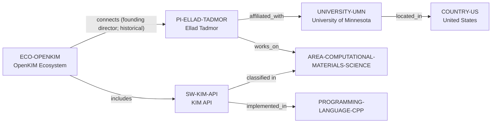

# OpenKIM–University of Minnesota vertical slice

> **Status:** reviewed Quality Gate 3 vertical slice, reviewed 2026-07-13.

## Purpose and scope

This slice adds a bounded OpenKIM path: the distinct public KIM API software
library, OpenKIM ecosystem, Ellad Tadmor's current University of Minnesota
affiliation, and a historical founding-director connection. It reuses the
existing United States, Computational Materials Science, and C++ records.

## Canonical graph



## Evidence boundaries

| Dimension | Canonical evidence | Boundary |
| --- | --- | --- |
| KIM API | The public repository describes a system-level library for interfaces between atomistic or molecular simulation programs and interatomic-model implementations; it shows public issue/pull-request paths, LGPL-2.1-or-later licensing, and C++ as its primary language. | No claim covers every client, model, test, driver, release, dependency, contributor, or user. |
| OpenKIM ecosystem | The KIM API project and OpenKIM update support a separate ecosystem record and public model/test/developer surfaces. | This is not a complete governance, funding, partner, or community census. |
| Tadmor and UMN | UMN supports current professor affiliation and atomistic materials-modelling context. | The affiliation does not establish supervision, openings, programme eligibility, or institutional ownership of OpenKIM. |
| Historical role | Tadmor's public CV identifies a Founding Director role for OpenKIM. | It is recorded as historical ecosystem context only, not as current coding, maintenance, review, governance, or support responsibility. |

## Deliberate omissions

- No person-to-software `develops` edge is introduced.
- No individual OpenKIM model, test, dataset, client code, contributor, funder,
  partner, group, department, project, event, or publication is modeled without
  a separately reviewed canonical identity and relationship.
- The slice makes no performance, model-accuracy, acceptance, mentoring,
  admissions, funding, language-environment, or applicant-fit conclusion.

## View reachability

The deterministic views expose each record under its canonical type. The
interactive command below returns KIM API because every supplied criterion has
a direct, evidence-bearing path:

```bash
python3 scripts/research_landscape.py discover-software \
  --area AREA-COMPUTATIONAL-MATERIALS-SCIENCE \
  --language PROGRAMMING-LANGUAGE-CPP \
  --ecosystem ECO-OPENKIM \
  --open-source yes
```

`discover-ecosystems --software SW-KIM-API` returns OpenKIM's explicit
`includes` relation. Neither command makes a claim about ecosystem dominance,
software quality, support, or personal access.

The review record is in [OpenKIM–University of Minnesota vertical slice
review](../reports/openkim-umn-vertical-slice-review.md).
