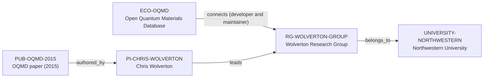

# OQMD ecosystem-intelligence vertical slice

> **Status:** reviewed Quality Gate 3 vertical slice, reviewed 2026-07-12.

## Purpose and scope

This Quality Gate 3 slice deepens the existing Open Quantum Materials Database
(OQMD)–Wolverton–Northwestern canonical cluster rather than creating a parallel
profile or an unreviewed backend-software duplicate. It adds a project-
recommended 2015 technical publication, records source-backed REST/OPTIMADE and
full-download data paths, and explains the deliberate absence of a public
contribution workflow in the reviewed evidence.

The graph remains intentionally sparse. Official sources support OQMD as a
high-throughput DFT materials database, public query/download interfaces,
documented structure sources, CC-BY 4.0 data context, the existing Wolverton
Research Group connection, and Chris Wolverton authorship of a technical
reference. They do not support an independently scoped backend software node,
exhaustive contributor/maintainer graph, current funding relationship, or
public code-contribution workflow.

## Canonical graph

## QG3 coverage matrix

| Required ecosystem dimension | Canonical evidence in this slice | Boundary |
| --- | --- | --- |
| Purpose and scientific scope | OQMD and Wolverton Group sources describe a high-throughput DFT materials database for data-driven research, screening, and discovery. | This does not establish every calculation, data property, or research application. |
| Architecture | Official pages document a public web/API system, REST/OPTIMADE interfaces, optional qmpy query route, and downloadable MySQL snapshots. | These documented access layers do not establish a backend software architecture or deployment/security graph. |
| Programming language | The OQMD access pages identify a qmpy API route but do not establish a canonical language entity in the graph. | No `programming_language_ids` value is added: the vNext Language entity contract is absent. |
| Maintainers and core contributors | Existing evidence establishes the Wolverton Research Group as developer and maintainer. | No individual maintainer, exhaustive contributor roster, or review/governance role is inferred. |
| Institutions and groups | Existing records preserve the Wolverton Group, Chris Wolverton, Northwestern, and research-area routes. | Northwestern is not asserted as exclusive owner and the group link is not duplicated as an individual maintenance claim. |
| Key publication | `PUB-OQMD-2015` has date, DOI, and a reviewed Chris Wolverton authorship relation. | The schema does not permit `describes → research-ecosystem`, so the historical OQMD subject remains evidence-backed prose rather than an unsupported edge. |
| Funding | No typed funding relationship is added. | Historical publication sponsor metadata and institutional context are insufficient to establish current OQMD funding in the frozen graph. |
| Public access and contribution workflow | REST/OPTIMADE, downloads, an optional query package, and contact route are documented. | No reviewed official source establishes a public source repository, contribution, code-review, or acceptance workflow; none is invented. |
| Community and user journey | Users can query/filter/download through browser/API routes or use full database dumps; the site directs users to cite the project references. | No response-time, support, account, community-size, or contributor-status promise is inferred. |
| Career relevance | Canonical sources expose learning surfaces in DFT data, REST/OPTIMADE APIs, query filtering, data downloads, database provenance, and citation practice. | No employment, admission, supervision, mentorship, or outcome recommendation is claimed. |
| Dependencies and related ecosystems | Source provenance and access interfaces are described in canonical prose. | The frozen schema lacks safe dependency/community entity types and an ecosystem-to-ecosystem predicate, so no speculative related-ecosystem edge is added. |

## Typical user journey

The documented upstream path is: explore OQMD through the site or call REST/
OPTIMADE endpoints to search, filter, and download selected data without user
credentials; use the optional query route as needed; or download a complete
versioned database snapshot for local use. The project’s publication page
identifies the references to cite. This is a source-backed data-access journey,
not a guarantee about API stability, data completeness, local system capacity,
support, or contribution acceptance.

## Deliberate omissions

- No Programming Language, Community, backend software, API endpoint, database,
  query package, dependency, workflow, detailed Maintainer, or external
  contributor node is created without a canonical entity and relationship
  contract.
- No complete author list, individual maintainer roster, contributor list,
  code-review role, public-source repository, or employment claim is inferred
  from a paper, API, download, or group page.
- No funding programme, award amount, current funding, opening, mentoring,
  admissions, language, ranking, or applicant-fit conclusion is made.
- No generated view, recommendation, or manual ecosystem ranking is added.

## View reachability

No generated view output is added. The enriched canonical graph supports these
future traversals without copied facts:

| View family | Traversal |
| --- | --- |
| Research ecosystem | `ECO-OQMD` → `connects` → `RG-WOLVERTON-GROUP` → direct host and PI paths. |
| Publication | `PUB-OQMD-2015` → `authored_by` → `PI-CHRIS-WOLVERTON`; its ecosystem subject is source-backed prose due to predicate limits. |
| Research group and University | `RG-WOLVERTON-GROUP` → `belongs_to` → `UNIVERSITY-NORTHWESTERN`. |
| Country and research area | Existing University-host and PI/group research-area routes remain derivable without duplicating records. |

The review and validation record is in [OQMD ecosystem-intelligence vertical
slice review](../reports/oqmd-ecosystem-intelligence-vertical-slice-review.md).
