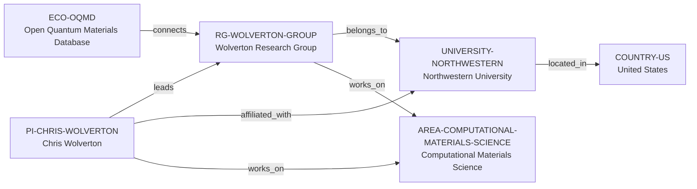

# OQMD–Wolverton vertical slice

> **Status:** third reviewed vNext vertical slice, reviewed 2026-07-12.

## Purpose and scope

This bounded Quality Gate 1 slice adds an OQMD–Wolverton–Northwestern chain.
It is the first real reviewed record to use the University-host branch accepted
in [ADR 0006](adr/0006-research-group-host-reference.md), rather than merely
testing that branch with a synthetic schema fixture.

OQMD is modeled as a research-data and software ecosystem. No backend software
record is created in this pass: the documented database and its supporting
software context should not be collapsed into one unreviewed software entity.

## Canonical graph

| Role | Canonical record | Scope |
| --- | --- | --- |
| Research ecosystem | [`ECO-OQMD`](../entities/ecosystems/oqmd.md) | The public OQMD database and documented group context. |
| Principal investigator | [`PI-CHRIS-WOLVERTON`](../entities/principal-investigators/chris-wolverton.md) | Public University affiliation, group leadership, and research-area links. |
| Research group | [`RG-WOLVERTON-GROUP`](../entities/research-groups/wolverton-research-group.md) | The named Northwestern-hosted group. |
| University | [`UNIVERSITY-NORTHWESTERN`](../entities/universities/northwestern-university.md) | The direct University host. |
| Country | [`COUNTRY-US`](../entities/countries/united-states.md) | Existing geographic endpoint reused by the University. |
| Research area | [`AREA-COMPUTATIONAL-MATERIALS-SCIENCE`](../entities/research-areas/computational-materials-science.md) | Existing controlled area reused by both PI and group. |

## Contract and evidence checks

| Rule | Result in this slice |
| --- | --- |
| Accepted direct-host rule | `RG-WOLVERTON-GROUP` has `institution_id: UNIVERSITY-NORTHWESTERN`, no `organization_id`, and a `belongs_to` assertion to the same University. |
| Target-type review | `UNIVERSITY-NORTHWESTERN` resolves to one reviewed v2 `university` record. No duplicate Organization is created. |
| One-way relationships | The graph has seven evidence-bearing assertions; no inverse assertion is hand-entered. |
| Evidence before inference | Reviewed records and assertions use record-local `SRC-*` keys resolved in their Evidence tables. |
| Country as a filter | The group resolves to `COUNTRY-US` through its University host. |
| Legacy preservation | Existing OQMD/Wolverton reports and the v1 anchor dossier keep their own scope and IDs. |

## Deliberate omissions

- No Northwestern Department or generic Organization duplicate is created.
- No direct OQMD-to-Chris Wolverton edge is inferred from the group relationship.
- No OQMD backend software entity is created until its independent scope is
  reviewed.
- No claim is made about OQMD's full contributor roster, exclusive ownership,
  individual maintenance, openings, mentoring, admissions, funding, language,
  or applicant fit.

## View reachability

No generated view output is added. The documented graph supports these future
traversals without copying profiles into views:

| View family | Traversal |
| --- | --- |
| Global | Reviewed `ECO-OQMD`, `PI-CHRIS-WOLVERTON`, and `RG-WOLVERTON-GROUP` are available when a generator implements the declared query. |
| Country | `RG-WOLVERTON-GROUP` → `UNIVERSITY-NORTHWESTERN` → `COUNTRY-US`. |
| Research area | `PI-CHRIS-WOLVERTON` or `RG-WOLVERTON-GROUP` → `works_on` → `AREA-COMPUTATIONAL-MATERIALS-SCIENCE`. |
| Ecosystems | `ECO-OQMD` → `connects` → `RG-WOLVERTON-GROUP` → University and PI relationships. |

The review and validation record is in
[OQMD–Wolverton vertical slice review](../reports/oqmd-wolverton-vertical-slice-review.md).
