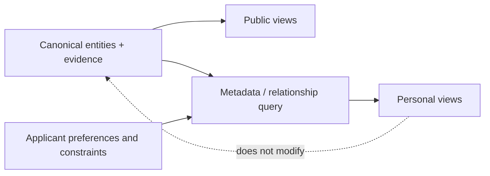

# Personalization and metadata-driven filtering

## Purpose

Personalization turns one reusable entity graph into an applicant-specific research process. It combines declared preferences with sourced entity metadata and typed relationships; it does not alter the underlying entities or make a personal preference look like a public fact.

**Status:** architecture contract only. No personal profiles, filters, or view outputs are created in this change.



## Layers and ownership

| Layer | Owns | Must not own |
| --- | --- | --- |
| Canonical entity | Public facts, relationships, source IDs, confidence, review dates | A particular applicant's needs, private notes, or decision order. |
| Filter definition | Repeatable predicates and unknown-value behavior | Copied profiles or unsourced membership claims. |
| Preference profile | An applicant's weights, hard constraints, and stated goals | Public assertions about an entity or another person's private information. |
| Personal view | References, derived scores, and next actions | A replacement for a canonical entity document. |

Personal configuration should be private by default. If a user explicitly shares a profile or shortlist, it must be sanitized and limited to research-relevant, consented information. No personal profile may change a canonical entity's fields, evidence, or global score.

## Filter vocabulary

The following vocabulary is the target contract for future frontmatter and relationship schemas. Until a field has a schema and a source, a view must not manufacture it by parsing narrative prose. The proposed vNext contract uses normalized IDs such as `country_id`, `institution_id`, `research_group_ids`, `research_area_ids`, `software_ids`, `programming_language_ids`, and `ecosystem_ids`; existing v1 fields—including `affiliation_ids`, `group_ids`, and `language_ids`—remain authoritative until a versioned migration maps them. See [vNext entity metadata](architecture/metadata.md).

| User-facing filter | Canonical field or relationship path | Evidence and semantics |
| --- | --- | --- |
| Country | Direct `country_id`, or entity → organization/university → Country | Resolve a stable Country ID; do not infer nationality or location from a name. |
| Europe / Asia | Country → `region` | Region is a controlled Country property, not a quality signal. |
| China / Sweden | Resolved Country ID | Country selection is exact-ID matching after name normalization. |
| Only accepting MSc / Only accepting PhD | `accepting_msc` / `accepting_phd` on a current program, PI, or group | The controlled value `"yes"` requires a dated primary source; `"unknown"` is distinct from `"no"` and an omitted field. |
| Open Source | Software license + documented governance/release/contribution evidence | A public repository alone is insufficient. |
| Python | Software → `programming_language_ids` → Python concept | Do not infer a person's proficiency from an account or citation. Existing v1 software uses `language_ids`. |
| Materials Informatics / Scientific Software / AI | `research_area_ids` and a controlled research-area hierarchy | Match IDs and documented parent relationships, not loose keyword text. |
| Open Positions | `volatile_assertions` where `subject = open-position` and `status = open` | Must carry `checked_at`, `review_by`, and non-empty source IDs; it expires. |
| Early Career PI | Dated, sourced career-stage metadata | Define the stage rule before using it as a filter. |
| Industry Collaboration | `industry_collaboration` plus a documented project/organization relationship | Do not infer from a university's location or a logo list. |
| Remote Collaboration | `remote_collaboration` with explicit policy, project practice, or opportunity evidence | Never infer from remote-friendly software work. |
| English-speaking | `instruction_language_codes` or `working_language_codes` includes `en` | Do not infer from country, nationality, or a website's language. |
| GitHub Active | `volatile_assertions` where `subject = github-activity`, `status = active`, and `threshold` is explicit | Activity is not a proxy for research quality, mentorship, or availability; it is a derived view predicate, not an unsourced person label. |

The controlled values named in a query should be stable IDs. Human labels such as `Python`, `China`, and `Materials Informatics` are resolved before evaluation; they are not the canonical storage keys.

## Combination semantics

Filters compose over metadata and graph edges. The default meaning is:

- `all`: every predicate must match (`AND`);
- `any`: at least one predicate must match (`OR`);
- `none`: no predicate may match (`NOT`);
- `unknown`: remains distinct from `"no"` and can be explicitly included, excluded, or surfaced for follow-up.

An illustrative query for a software-oriented materials applicant is below. It is a design example, not an executable schema.

```yaml
view_id: my-shortlist/materials-python-msc
target_entity_type: principal-investigator
all:
  - path: research_area_ids
    intersects: [<materials-informatics-id>]
  - any:
      - relation:
          traverse: uses
          entity_type: research-software
          where:
            programming_language_ids: [<python-id>]
      - relation:
          traverse: develops
          entity_type: research-software
          where:
            programming_language_ids: [<python-id>]
  - path: accepting_msc
    equals: "yes"
  - relation:
      traverse: affiliated_with
      entity_type: country
      where:
        region: Europe
any:
  - path: open_source
    equals: "yes"
  - volatile_assertion:
      subject: github-activity
      status: active
      threshold: <profile-defined-threshold>
none:
  - path: status
    equals: retired
evidence:
  minimum_confidence: medium
  unknown_policy: surface_for_review
```

The same profile can replace `accepting_msc` with `accepting_phd`, choose Asia, China, or Sweden through the Country relationship, or add documented industry/remote/English-language constraints. A query should record those changes as profile versions, rather than overwrite the entity data.

## Eligibility, relevance, and accessibility

Use three separate stages instead of one opaque filter.

1. **Eligibility filters** answer hard, time-sensitive questions: degree level, explicit program rules, and a dated opening where one is required.
2. **Research and software filters** identify documented overlap: research areas, methods, software, languages, ecosystems, and collaboration evidence.
3. **Accessibility filters** answer applicant-specific feasibility questions: mobility, language, funding route, remote possibilities, and other personal constraints.

Stages one and three should expose unknowns for due diligence. For example, no current public MSc opening is not proof that a PI cannot supervise; it is `unknown` unless a reliable source says otherwise.

## Evidence and refresh rules

- Every filterable claim needs a source ID, confidence, and review date in the canonical record or relation.
- Volatile claims—open positions, admissions, funding calls, current roles, and active repository status—need a review-by date.
- A metadata correction changes the canonical record once; all affected views are then recomputed.
- A future indexer may improve discovery, but it must preserve canonical links, query version, evidence window, and unknown values.

The existing [global source register](../reports/global-sources.md), [anchor dossiers](../research-leaders/README.md), and [computational-materials scorecard](../scoring/v1/computational-materials-career-fit.md) are useful examples of the evidence discipline that future filters must retain.
