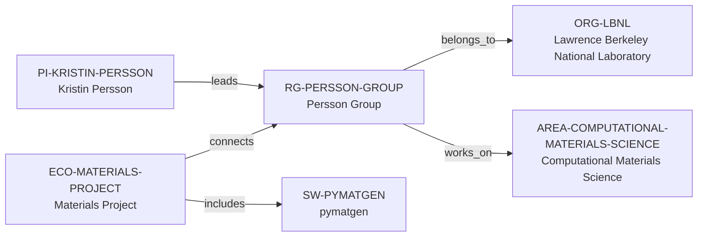

# Persson Group intelligence vertical slice

> **Status:** first reviewed Quality Gate 4 Research Group Intelligence slice, reviewed 2026-07-12.

## Purpose and scope

This Quality Gate 4 slice deepens the existing Persson Group canonical record
without creating a parallel lab profile, people registry, opportunity tracker,
or ranking. It captures group-level research themes, visible role categories,
software practice, infrastructure context, projects, collaboration signals,
publication surface, bounded mentorship evidence, and selected public alumni
outcomes from first-party sources.

The result is intentionally evidence-bounded. The source pages support a group
working on computational materials and battery research using DFT, MD, high-
performance computing, machine learning, natural-language processing, Materials
Project infrastructure, and publicly released code. They do not establish every
person’s status, a comprehensive funding portfolio, all collaborations,
industry partners, a quantitative placement record, a universal mentorship
standard, or current vacancy availability.

## Canonical graph

The slice adds no speculative people, students, collaborators, funding,
software, or industry nodes. The existing typed graph remains the canonical
navigation layer; detailed group intelligence lives as cited evidence in the
group record and this review, not as copied metadata in new entities.

## QG4 coverage matrix

| Required group dimension | Canonical evidence in this slice | Boundary |
| --- | --- | --- |
| Research themes | The group describes atomistic computational materials science, batteries, synthesis, symmetry, DFT, MD, HPC, ML, NLP, reaction networks, and high-throughput work. | These themes are group scope, not every member’s individual focus or a complete topic taxonomy. |
| Scientific software maturity | The group describes Materials Project database/analysis expansion, workflows, source-code publication practice, and public software projects. | It does not support a new group-to-pymatgen development/maintenance edge or group ownership of every listed project. |
| Programming stack | Group pages and the dated intern role explicitly identify Python; the role also names JavaScript, Plotly Dash, and React as desirable skills. | No `programming_language_ids` value is added because the approved Language entity contract is absent; role requirements are not universal group requirements. |
| Software ecosystem participation | Existing `ECO-MATERIALS-PROJECT → connects → RG-PERSSON-GROUP` relation is retained; group research describes expanding Materials Project data and analysis capabilities. | This is not proof that all group members contribute to every Materials Project component. |
| Open-source activity | The software page says the group aims to publish code promptly and points to the Materials Project GitHub organization and projects. | Source availability does not establish every license, maintainer, contributor, or code-review role. |
| Students, postdocs, and staff | The current public people page uses distinct postdoctoral, graduate-student, staff, undergraduate, visitor, and alumni sections. | The page is a public roster, not a verified headcount, employment ledger, or a record for each individual. |
| Funding | The group sources reviewed here do not provide a reliable group-level funding ledger. | No funding relationship, funder, amount, award, or funding inference is added. |
| Infrastructure | The group reports high-performance-computing methods and its LBNL Energy Sciences Area base; its research describes Materials Project computational infrastructure. | This is not a hardware allocation, availability, or exclusive-hosting claim. |
| Major projects | Materials Project and named battery, electrolyte, solid-electrolyte-interphase, synthesis, and symmetry research projects are described. | Project descriptions are not separate canonical Project entities until their identities and relationships are independently reviewed. |
| International and experimental collaboration | The group calls Materials Project multi-institutional/multinational and says it collaborates heavily with experimental teams. | No partner roster, institution edge, industry-collaboration claim, or bilateral collaboration relation is inferred. |
| Publication patterns | The official chronological page shows continuing, diverse peer-reviewed research output, including 2026 materials, computational, and data-driven articles. | No publication count, quality score, productivity ranking, attribution, or causality is claimed. |
| Mentorship evidence | A dated undergraduate Materials Project intern listing states weekly updates and one-to-one senior-developer guidance, feedback, and support for that specific role. | This is role-specific evidence, not a universal group-wide mentorship rating, current vacancy, or supervision promise. |
| Career outcomes | The public alumni section names selected subsequent destinations in academia, research, industry, consulting, and startups; the news page records dated student awards. | No placement rate, causal claim, typical outcome, or guarantee is inferred. |

## Evidence-bounded research environment

The group’s public sources portray a research environment at the intersection
of atomistic computation, data infrastructure, battery/materials discovery, and
software-enabled research. The people page provides categories rather than
merely names, which is useful for seeing that publicly listed postdoctoral,
graduate, staff, undergraduate, visitor, and alumni perspectives exist. The
software and research pages tie that environment to Materials Project data and
analysis capabilities, public code release, and a blend of DFT/MD/HPC/ML/NLP
methods.

The dated intern description is the only source in this slice that makes a
specific mentoring-process statement: weekly updates and one-to-one senior-
developer guidance, feedback, and support. It is not generalized beyond that
intern role. Similarly, alumni destinations are presented only as selected
public biographies, not as an outcome statistic or a reason to expect a
particular trajectory.

## Deliberate omissions

- No individual staff, postdoc, student, alum, collaborator, funder, industry
  partner, project, facility, code, or workflow is created as a canonical entity
  without its own independently reviewed identity and relationship evidence.
- No current-opening, hiring, admission, funding, compensation, supervision
  capacity, language, or applicant-fit claim is made from the dated opportunity
  page or any other source.
- No group-wide mentorship, culture, management, publication-quality, or career
  outcome rating is calculated or implied.
- No new relationship predicate, schema field, persistent validator, generated
  view, or architecture change is introduced.

## View reachability

No generated view output is added. The enriched group record supports these
future evidence-led traversals without copied facts:

| View family | Traversal |
| --- | --- |
| Research group | `RG-PERSSON-GROUP` → direct LBNL host, computational-materials area, PI leader, and Materials Project context. |
| Research software ecosystem | Materials Project → Persson Group; Materials Project → pymatgen, with the documented group/software boundary retained. |
| People and roles | Existing PI leadership, plus source-backed group role categories in canonical prose; individual records require separate review. |
| Career and opportunity diligence | Source-backed, role-specific internship guidance and selected alumni outcomes, each preserving time/scope limitations. |

The review and validation record is in [Persson Group intelligence vertical
slice review](../reports/persson-group-intelligence-vertical-slice-review.md).
