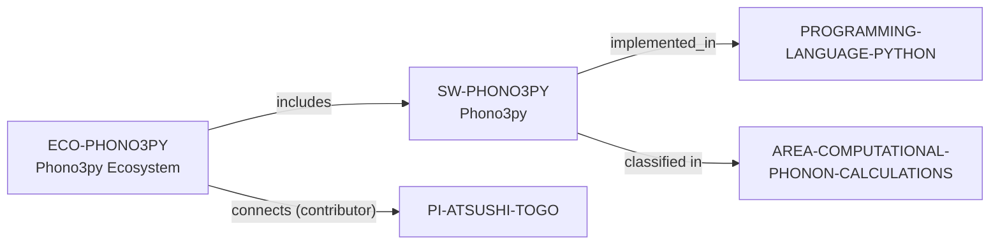

# Phono3py ecosystem vertical slice

> **Status:** reviewed vertical slice, reviewed 2026-07-13.

This slice adds separate Phono3py software and ecosystem records, reusing
controlled Python, Computational Materials Science, Computational Phonon
Calculations, and Atsushi Togo records. It establishes only BSD-3-Clause
phonon–phonon-interaction and thermal-transport scope, a documented primary
Python implementation, public contribution routes, and a bounded contributor
connection.

External calculator interfaces, dependencies, and a Rust backend reference are
documentation context only; none becomes a software relation or extra language
entity in this increment. Public source, issues, pull requests, and mailing
lists do not establish contribution acceptance, support, mentoring, funding,
admissions, or applicant fit.

The review record is in [Phono3py ecosystem vertical slice review](../reports/phono3py-ecosystem-vertical-slice-review.md).
