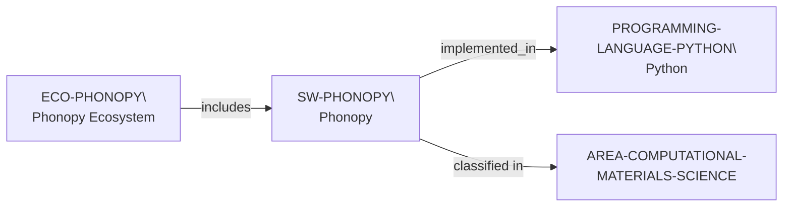

# Phonopy ecosystem vertical slice

> **Status:** reviewed vertical slice, reviewed 2026-07-13.

This slice adds separate Phonopy software and ecosystem records, reusing
controlled Python and Computational Materials Science records. It establishes
only open harmonic/quasi-harmonic phonon-calculation scope, a BSD-3-Clause
software license, a documented primary Python implementation, and public
documentation and participation routes.

The source notes a Rust compute backend, but this increment records only the
directly stated primary Python implementation and deliberately does not add an
unreviewed secondary-language concept. Public source, issues, pull requests,
mailing list, and calculator interfaces do not establish contributor roles,
acceptance, review, support, dependencies, mentoring, funding, admissions, or
applicant fit.

The review record is in [Phonopy ecosystem vertical slice review](../reports/phonopy-ecosystem-vertical-slice-review.md).
