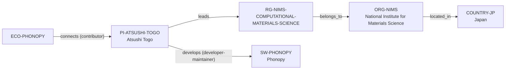

# Phonopy–NIMS environment extension

> **Status:** reviewed environment extension, reviewed 2026-07-13.

This extension turns the reviewed Phonopy software route into a bounded,
source-explainable academic-environment path: developer-maintainer Atsushi
Togo, the named NIMS Computational Materials Science Group, its direct NIMS
host, and Japan. It adds no claim about a university programme, degree route,
mentorship quality, rankings, admissions, openings, or group-wide software
roles.

The NIMS feature is current as of March 2026 and supports Togo's stated
developer-maintainer role. The Phonopy documentation separately supports a
bounded contributor connection. Neither source establishes exclusive ownership,
governance, review authority, complete maintenance/community membership, or
career-outcome claims.

The review record is in [Phonopy–NIMS environment extension review](../reports/phonopy-nims-environment-extension-review.md).
