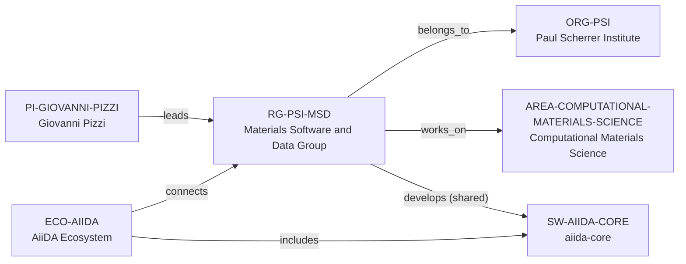

# PSI Materials Software and Data intelligence vertical slice

> **Status:** eleventh reviewed Quality Gate 4 Research Group Intelligence slice, reviewed 2026-07-12.

## Purpose and scope

This Quality Gate 4 slice deepens the existing PSI Materials Software and Data
(MSD) Group with current first-party PSI evidence. It exposes its public
simulation-algorithm, spectroscopy, workflow, data, interface, open-science,
and autonomous-laboratory context without reproducing a roster or creating a
second AiiDA/Materials Cloud record, project catalog, funding ledger, or
opportunity feed.

PSI directly supports the existing shared group-level development relationship
to AiiDA. Its broader statements about open-source codes and Materials Cloud
remain group context: individual codes and roles need their own canonical
identity and relationship evidence.

## Canonical graph

Existing AiiDA, AiiDAlab, Materials Cloud, and PSI entities retain their own
facts. The graph is not expanded from a web page's references to every
software, project, dataset, partner, or person.

## QG4 coverage matrix

| Required group dimension | Canonical evidence in this slice | Boundary |
| --- | --- | --- |
| Research themes | Simulation algorithms for novel materials and PSI spectroscopy, automation, high-throughput simulation, interfaces, data, and autonomous laboratories. | These are public group priorities, not a complete project or individual-research inventory. |
| Scientific software maturity | PSI describes open-source codes, AiiDA-engine development, AiiDAlab, Materials Cloud, automated simulations, curated datasets, and web interfaces. | No maturity score, service level, code catalog, license/governance, or individual maintainer roster is inferred. |
| Programming stack | The reviewed group page does not establish a group-wide programming-language policy. | No language entity or language claim is inferred. |
| Software ecosystem participation | Existing shared MSD → aiida-core development and AiiDA ecosystem relations remain canonical. | AiiDAlab/Materials Cloud mentions do not create group ownership or every-software relation. |
| Open-source activity | PSI explicitly refers to several open-source codes and Materials Cloud. | This does not prove all group work is open, or that any individual is a contributor/reviewer. |
| Students, postdocs, and staff | PSI displays group-leader, scientist, postdoctoral, and PhD-student roles and an October 2025 group photo. | The dynamic display is not a complete roster, headcount, employment history, supervision map, or career path. |
| Funding | PSI says research is supported by several projects and links a laboratory project page. | No funder, award, amount, project identity, or active capacity is inferred. |
| Infrastructure | The page describes platforms, data, simulation services, high-throughput workflows, and an autonomous-lab goal. | No access, deployment, availability, compute allocation, or user-service commitment is inferred. |
| Major projects | An internal PSI projects link exists, but the reviewed page does not establish stable project identities for this graph. | No Project entity or participation relation is created. |
| International and industry collaboration | The page says simulation services reach PSI and worldwide researchers. | This is not a partner inventory, collaboration graph, industry relation, or access promise. |
| Publication patterns | PSI exposes a group publication list with recent software, workflow, data, and materials papers. | It is not a complete bibliography, productivity/quality metric, or individual attribution record. |
| Mentorship evidence | Public role categories do not establish a supervision practice or mentoring outcome. | No mentoring-quality, training, admissions, or outcome claim is made. |
| Career outcomes | No reviewed source provides alumni outcomes. | No placement, causal, or guarantee claim is made. |

## Evidence-bounded research environment

MSD provides a high-signal software-and-data environment: PSI explicitly
connects simulation algorithms and spectroscopies with workflows, open-science
platforms, datasets, and accessible interfaces. The existing AiiDA path makes
one part of this environment machine-navigable with direct, evidence-bearing
edges while preventing a claim that all referenced tools are owned by or
maintained by the group.

The PSI people, publications, project, software, and openings links are useful
starting points for live diligence. They must be rechecked before contact or an
application and cannot establish a present role, funding, user-service access,
eligibility, supervision capacity, or career outcome in the canonical graph.

## Deliberate omissions

- No individual member, code, project, funder, dataset, collaborator, facility,
  or publication is created without a separately reviewed canonical identity and
  evidence-backed relation.
- No claim is made about a programming-language policy, software license,
  governance, test/CI practice, every contributor, or exclusive AiiDA/Materials
  Cloud stewardship.
- No live opening, admission, funding, salary, language, visa, service access,
  supervision, mentorship, applicant fit, or career outcome is inferred.
- No ranking, productivity measure, mentorship score, or compatibility result
  is calculated.

## View reachability

No generated view output is added. The enriched record supports future
evidence-led traversals without copied facts:

| View family | Traversal |
| --- | --- |
| Research group | `RG-PSI-MSD` → PSI direct host and Computational Materials Science area. |
| Software ecosystem | MSD → shared aiida-core development ← AiiDA ecosystem. |
| Software/data diligence | Group context → workflows, interfaces, curated data, open-science platforms, and autonomous-lab goal. |
| People/publication/opportunity diligence | Source-bound PSI displays, with full roster, live status, and outcomes explicitly excluded. |

The review and validation record is in [PSI MSD intelligence vertical slice
review](../reports/psi-msd-intelligence-vertical-slice-review.md).
