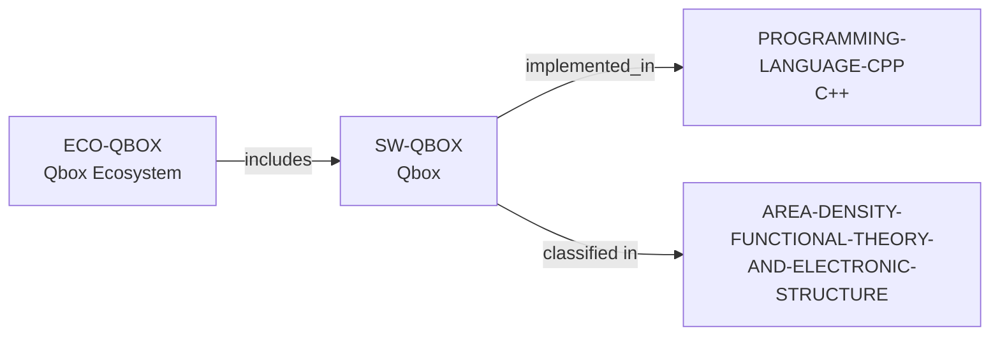

# Qbox ecosystem vertical slice

> **Status:** reviewed vertical slice, reviewed 2026-07-13.

This slice adds separate Qbox software and ecosystem records, reusing controlled
C++, Computational Materials Science, and DFT/Electronic Structure records. It
establishes only GPL-2.0-or-later C++/MPI/OpenMP first-principles molecular
dynamics and plane-wave DFT scope plus public source and participation routes.

Public source, issues, and pull requests do not establish contributor roles,
acceptance, review, response, support, mentoring, funding, admissions, or
applicant fit. No performance, complete-interface, dependency, institution, or
complete-community claim is inferred.

The review record is in [Qbox ecosystem vertical slice review](../reports/qbox-ecosystem-vertical-slice-review.md).
