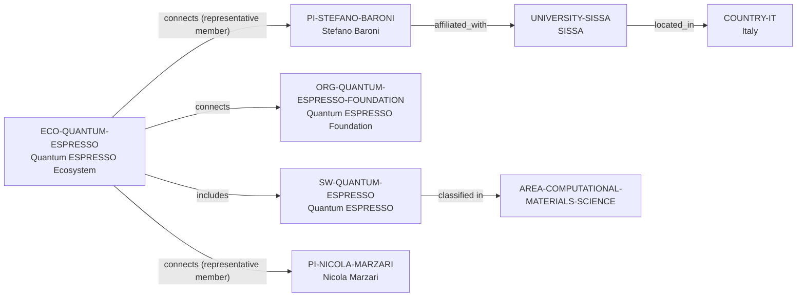

# Quantum ESPRESSO ecosystem-intelligence vertical slice

> **Status:** reviewed Quality Gate 3 vertical slice, reviewed 2026-07-12.

## Purpose and scope

This slice converts the existing Quantum ESPRESSO discovery trail into a
bounded canonical software–ecosystem–Foundation–PI–University path. It adds the
open-source Quantum ESPRESSO software suite, the separately modeled Quantum
ESPRESSO ecosystem and Foundation, SISSA and Italy as Baroni's direct
affiliation path, and his documented historical project/Foundation context. It
also reuses Nicola Marzari's existing canonical record only for the
Foundation's representative-member listing.

## Canonical graph

## QG3 coverage matrix

| Required ecosystem dimension | Canonical evidence in this slice | Boundary |
| --- | --- | --- |
| Purpose and scientific scope | Official project material identifies an open-source suite for electronic-structure calculations and nanoscale materials modelling based on DFT, plane waves, and pseudopotentials. | No capability, performance, or application-wide conclusion is made. |
| Software and license | The public `QEF/q-e` GitLab repository identifies the suite and GPL-2.0-or-later distribution. | No module, fork, release, dependency, or support commitment is inferred. |
| Foundation and community | The Foundation describes its community, open-source-protection, training, official-voice, and copyright-management objectives; project sources document forums, mailing lists, issues, and merge requests. | This does not establish an exhaustive governance, legal, financial, or membership graph. |
| Representative people and affiliation | Foundation material lists Stefano Baroni and Nicola Marzari as representative members; SISSA's current profile supports Baroni's full-professor affiliation, while a SISSA CV separately supports historical initiator/founding-director context. | Representative and historical roles do not establish current coding, maintenance, governance, or contribution frequency. |
| Contribution and learning path | The project documents GitLab, issues, merge requests, developer documentation, and user/developer forums and mailing lists. | These public routes do not promise acceptance, review, support, account access, mentoring, or career outcomes. |
| Research-area discovery | The software is directly classified under Computational Materials Science from its electronic-structure and materials-modelling description. | The classification does not claim every DFT application or related tool belongs to the same area. |

## Deliberate omissions

- No research group, department, contributor, partner, pseudopotential, module,
  dependency, package, publication, dataset, funding, or event entity is
  created without a separately reviewed canonical identity and relation.
- No controlled programming-language node is added: the current corpus has no
  reviewed Fortran language entity or source-specific implementation assertion
  for this software record.
- No person-to-software `develops` edge is asserted. Baroni's historical
  initiator role and Foundation representative listings are not equivalent to
  a current development or maintenance assignment.
- No ranking, opening, supervision, mentoring, admissions, funding, or
  applicant-fit conclusion is made.

## View reachability

The deterministic generator exposes the slice through the Global, Research
Software, Research Ecosystem, Research Area, and Principal Investigator views.
The interactive `discover-ecosystems --software SW-QUANTUM-ESPRESSO` command
returns the included ecosystem and its exact evidence-bearing path without
claiming ecosystem dominance or personal access.

The review record is in [Quantum ESPRESSO ecosystem-intelligence vertical slice
review](../reports/quantum-espresso-ecosystem-intelligence-vertical-slice-review.md).
