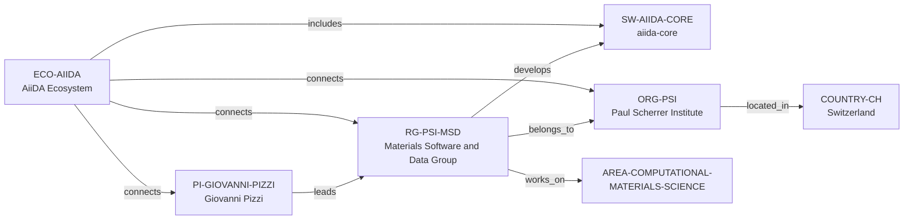

# AiiDA reference implementation

> **Status:** first end-to-end vNext vertical slice, reviewed 2026-07-11.

## Purpose and selection

This is the first production-quality reference implementation of the repository
architecture. It is deliberately one small, evidence-bounded graph, not a
migration of the existing global corpus.

The slice uses **AiiDA** rather than Materials Project. Both already have
legacy research material, but current first-party sources establish AiiDA's
software, ecosystem, research group, group leader, host organisation, and
materials-simulation connection with fewer identity assumptions. In particular,
`aiida-core` is a distinct software artifact, whereas Materials Project would
require resolving a platform-versus-many-software boundary before choosing a
single software node.

No architecture document, legacy factual dossier, path, or historical
conclusion was migrated or rewritten. The legacy navigation indexes receive an
explicit compatibility boundary, and the other legacy changes are links added
after canonical records were created.

## Canonical graph

| Role | Canonical record | Why it is in scope |
| --- | --- | --- |
| Research software | [`SW-AIIDA-CORE`](../entities/research-software/aiida-core.md) | The distinct, official AiiDA codebase. |
| Research ecosystem | [`ECO-AIIDA`](../entities/ecosystems/aiida.md) | The public ecosystem that identifies `aiida-core` as its foundation. |
| Principal investigator | [`PI-GIOVANNI-PIZZI`](../entities/principal-investigators/giovanni-pizzi.md) | Publicly identified leader of the immediate group. |
| Research group | [`RG-PSI-MSD`](../entities/research-groups/materials-software-and-data-group.md) | The documented group that develops AiiDA alongside the broader community. |
| Institution / organisation | [`ORG-PSI`](../entities/organizations/paul-scherrer-institute.md) | The accountable PSI host; it is not modeled as a university. |
| Country | [`COUNTRY-CH`](../entities/countries/switzerland.md) | The geographic endpoint for PSI, usable as a view facet. |
| Research area | [`AREA-COMPUTATIONAL-MATERIALS-SCIENCE`](../entities/research-areas/computational-materials-science.md) | The narrow documented subject connection for the group and AiiDA engine. |

## Contract validation

| Architectural rule | How the slice validates it |
| --- | --- |
| One public fact owner | All reusable facts live in one v2 entity under `entities/`; reports and legacy dossiers link rather than copy them. |
| Schema-shaped metadata | Each canonical record has the v2 common envelope, its entity-specific required fields, reviewed confidence, and source IDs. |
| Typed, one-way relationships | Public graph edges are `relationship_assertions` on their canonical subject only. No inverse edges were hand-entered and `relationships/` was not used. |
| Evidence before inference | Each entity and edge has a first-party URL in the entity body, a cited source ID, confidence, and an evidence window where the relationship is current. |
| Country as a filter | PSI reaches `COUNTRY-CH` through `located_in`; no AiiDA entity is placed below a country directory. |
| Legacy preservation | Existing reports and dossiers remain in place and retain their historical or applicant-specific scope. |

### Source-ID boundary

The v2 schema requires `source_ids` on reviewed records and on every rich
relationship assertion, but the repository has no canonical Source/Evidence
entity type, namespace, or resolver. To keep the slice traceable without
inventing that missing model, each `SRC-*` value is a **record-local citation
key** resolved by the record's Evidence table. It is not a graph node and does
not reclassify a report-scoped source register as a canonical source store.
This is a documented contract gap, not a new source architecture.

## View validation

No generated view output has been added. The repository deliberately has no
executable view manifest or generator yet, and a hand-maintained result list
would violate the view boundary. The following checks establish that the same
records can be reached naturally from all required view families.

| View | Reachable records / traversal | Result |
| --- | --- | --- |
| [Global](../views/global/README.md) | `PI-GIOVANNI-PIZZI`, `RG-PSI-MSD`, `SW-AIIDA-CORE`, and `ECO-AIIDA` have `status: reviewed`; their canonical links and source coverage are available. | Eligible once a generator implements the declared global query. |
| [Country](../views/countries/README.md) | `RG-PSI-MSD` → `ORG-PSI` → `COUNTRY-CH`. | Country membership is derived through the documented host relationship, not copied onto the group or software. |
| [Research area](../views/research-areas/README.md) | `RG-PSI-MSD` → `works_on` → `AREA-COMPUTATIONAL-MATERIALS-SCIENCE`. | Subject membership comes from an evidence-bearing group relation. |
| [Research software](../views/research-software/README.md) | `SW-AIIDA-CORE` ← `develops` ← `RG-PSI-MSD`; `ECO-AIIDA` → `includes` → `SW-AIIDA-CORE`. | Stewardship and ecosystem navigation are derived from typed edges without copied profiles. |
| [Ecosystems](../views/ecosystems/README.md) | `ECO-AIIDA` connects the software, PI, group, and organisation. | The ecosystem is a first-class node rather than a country proxy. |

### Known view limitation: programming language

Official AiiDA sources describe `aiida-core` as a Python framework. That fact
is intentionally not represented as `programming_language_ids` in this slice:
the vNext schema permits the field, but it defines neither a
`programming-language` entity type nor an `entities/programming-languages/`
namespace. The retained v1 schema is not enough to infer a v2 canonical path.
Consequently, a Python-filtered software view cannot be fully resolved yet. See
the review for the required contract decision.

## Compatibility navigation

| Existing versioned document | Compatibility action | Authority retained by the document |
| --- | --- | --- |
| [`entities/README.md`](../entities/README.md) | Links the complete AiiDA cluster from the existing canonical-namespace entry point. | Namespace orientation only; entity facts remain in the linked records. |
| [Global](../views/global/README.md), [Country](../views/countries/README.md), [Research area](../views/research-areas/README.md), [Research software](../views/research-software/README.md), and [Ecosystems](../views/ecosystems/README.md) view definitions | Link the reference records as compatibility/navigation examples while retaining derived-view rules. | Query contract and presentation rules; no view receives a copied profile or manual result list. |

The separate legacy report and dossier corpus remains preserved and can receive
additional links only in a later change that carries those records together;
this focused slice does not absorb that corpus.

## What worked well

The entity, relationship, country-as-facet, and legacy-link boundaries worked
without adding a database, a web application, or duplicate dossiers. The
reviewed AiiDA sources made it practical to create a sparse graph with direct
evidence rather than broad inferred associations.

## What still feels awkward

The awkward parts are structural rather than factual: source IDs have no
canonical resolver, programming languages straddle v1 and v2, relation index
fields can overlap rich assertions, identifier allocation has no registry, and
views have no machine-readable manifest or generator.

## Changes before broad migration

Resolve those contracts, add graph and view validation, and use this cluster as
the regression fixture before migrating more entities. The concrete priorities
and open questions are recorded in [the implementation review](../reports/reference-implementation-review.md).
