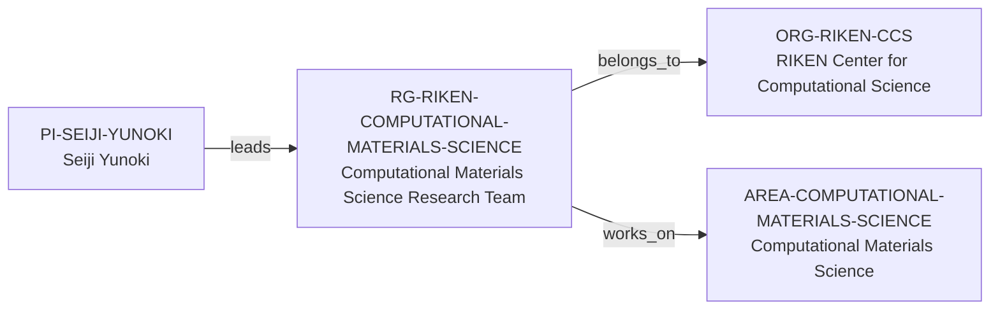

# RIKEN Computational Materials Science intelligence vertical slice

> **Status:** tenth reviewed Quality Gate 4 Research Group Intelligence slice, reviewed 2026-07-12.

## Purpose and scope

This Quality Gate 4 slice deepens the existing RIKEN Computational Materials
Science Research Team using its first-party R-CCS team page. It documents the
team's method-development focus, research-result context, public people roles,
selected publications, and annual-report/job-navigation surfaces without
converting those page sections into people, software, publication, project,
funding, or opportunity records.

The page centers numerical methods for strongly correlated quantum systems:
quantum Monte Carlo, tensor networks including density-matrix renormalization,
quantum algorithms, and simulations on classical supercomputers. A described
quantum-Monte-Carlo application is evidence of method/software work but does
not expose the stable public identity, license, repository, or maintenance
evidence needed for a new Research Software record.

## Canonical graph

No named software edge is created from a technical description alone. Existing
PI and host records remain the canonical owners of their respective facts.

## QG4 coverage matrix

| Required group dimension | Canonical evidence in this slice | Boundary |
| --- | --- | --- |
| Research themes | Numerical methods for strongly correlated quantum systems, condensed-matter/materials-science keywords, quantum algorithms, and supercomputer simulations. | This is public group scope, not a complete subject taxonomy or every member's work. |
| Scientific software maturity | The team describes development of a quantum-Monte-Carlo software application for large simulations. | No stable software identity, repository, license, maturity rating, ownership, or maintainer roster is available for canonicalization. |
| Programming stack | The reviewed source does not make a language claim. | No programming language is inferred from quantum/HPC work or web navigation. |
| Software ecosystem participation | No reviewed source supports a precise named ecosystem relation. | A generic R-CCS software navigation link and method description are not ecosystem membership. |
| Open-source activity | The reviewed team surface does not establish an open-source project or contribution workflow. | No openness, source code, licensing, CI, documentation, or community claim is inferred. |
| Students, postdocs, and staff | The public page displays Team Principal, senior-research-scientist, postdoctoral, technical, junior-research, and visiting-scientist roles. | This is not modeled as a complete roster, headcount, employment history, supervision structure, or career path. |
| Funding | No team-level award or programme relation is evidenced. | No grant, funding, capacity, or funder relation is inferred. |
| Infrastructure | The research summary names classical supercomputer simulations; one result describes historical K-computer calculations. | This does not prove current Fugaku allocation, access, infrastructure availability, or support. |
| Major projects | Research results and annual reports are publicly linked but lack a bounded project identity/relationship set. | No Project entity is created. |
| International and industry collaboration | The reviewed page provides no group-level partner inventory. | No collaboration or industry graph is inferred. |
| Publication patterns | The page displays representative papers and annual reports. | It is not a complete bibliography, productivity/quality signal, or individual-attribution measure. |
| Mentorship evidence | Public role and job-navigation surfaces do not establish supervision or mentoring practice. | No mentorship-quality, admissions, training, or outcome claim is made. |
| Career outcomes | No reviewed source provides alumni outcomes. | No placement, causal, or guarantee claim is made. |

## Evidence-bounded research environment

The public surface is strongest as a method and scale signal: numerical
algorithm development, quantum simulations, and high-performance computing in
computational materials/condensed matter. It supports a future researcher
asking what computational methods the group publicly emphasizes. It does not
support conclusions about research-software culture, current compute access,
live recruitment, a degree program, supervision capacity, or applicant fit.

The people and publication sections are useful for directed diligence, but they
remain source-bounded displays. The generic RIKEN job search and broader
R-CCS internship/school/graduate-programme navigation cannot be turned into
team-specific opportunities or qualifications without direct team evidence.

## Deliberate omissions

- No people, papers, software, projects, funders, collaborators, facilities,
  data, or external hosts are created from the page display alone.
- No claim is made about an open-source codebase, a programming language,
  license, testing, documentation, workflow, or named ecosystem.
- No current vacancy, internship, degree route, admission, funding, language,
  mentorship, supervision, applicant-fit, or career-outcome claim is made.
- No prestige, publication, productivity, mentoring, or compatibility ranking
  is calculated.

## View reachability

No generated view output is added. The enriched record supports future
evidence-led traversals without copied facts:

| View family | Traversal |
| --- | --- |
| Research group | `RG-RIKEN-COMPUTATIONAL-MATERIALS-SCIENCE` → R-CCS direct host and Computational Materials Science area. |
| Research-area/method diligence | Team context → numerical methods, quantum systems, and supercomputer-based simulation. |
| People/publication diligence | Source-bound public role and representative-paper surfaces, without generated person or publication records. |
| Infrastructure and opportunity diligence | Public scale/job-navigation clues with current availability and team scope explicitly excluded. |

The review and validation record is in [RIKEN Computational Materials Science
intelligence vertical slice review](../reports/riken-computational-materials-science-intelligence-vertical-slice-review.md).
