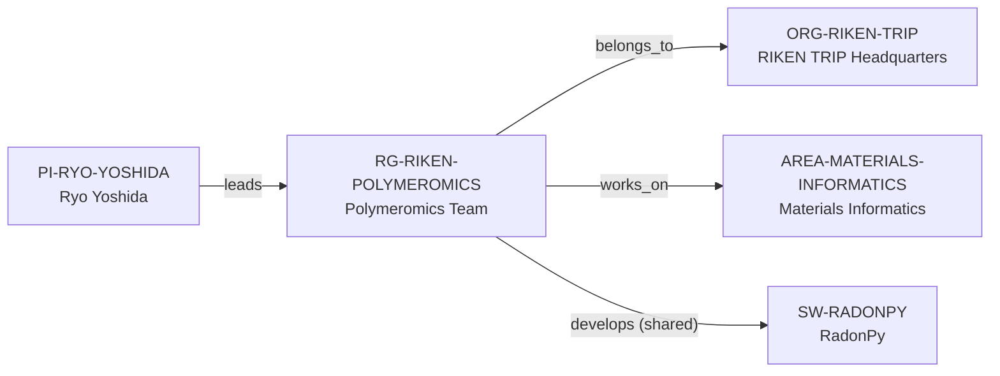

# RIKEN Polymeromics intelligence vertical slice

> **Status:** ninth reviewed Quality Gate 4 Research Group Intelligence slice, reviewed 2026-07-12.

## Purpose and scope

This Quality Gate 4 slice deepens the existing RIKEN Polymeromics Team using
the current first-party team page already cited by its canonical record. The
page gives a bounded view of the group: research scope, methods, key terms,
selected publications, a named core-member roster, and RadonPy. This slice
makes that evidence discoverable without turning a web page into a roster,
publication database, project catalog, funding ledger, or opportunity board.

The group describes automated computational experiments based on molecular
dynamics and first-principles calculations, combined experimental/computational
polymer databases, foundation models, Sim2Real machine learning, and AI- and
robotics-driven autonomous discovery. It is part of the Advanced General
Intelligence for Science Program at RIKEN TRIP.

## Canonical graph

The team page supports the existing shared group-to-RadonPy relation. It does
not identify a complete maintainer roster or justify individual software edges.
Other named research directions and selected publications remain source-bounded
context until their entities and exact relationships can be independently
reviewed.

## QG4 coverage matrix

| Required group dimension | Canonical evidence in this slice | Boundary |
| --- | --- | --- |
| Research themes | Polymer databases, foundation models, MD/first-principles automation, Sim2Real ML, and AI/robotics autonomous discovery are stated by RIKEN. | The public summary is not a complete program or member-level research inventory. |
| Scientific software maturity | Existing `SW-RADONPY` provides the independent open-source Python software record; the team page lists it as a selected output. | No maturity rating, exclusive ownership, governance, lifecycle, or individual maintainer claim is inferred. |
| Programming stack | RadonPy's canonical software record documents Python; group research explicitly includes MD and first-principles automated computation. | This does not establish a group-wide language policy or create new language/code records. |
| Software ecosystem participation | The existing shared team → RadonPy development relation connects research scope to an independently documented artifact. | RadonPy is not treated as a complete team ecosystem or a claim about each member's role. |
| Open-source activity | The team publicly links the RadonPy GitHub resource; the canonical software record documents it as open source. | A link does not establish every output's license, contribution flow, testing, or individual contribution. |
| Students, postdocs, and staff | The RIKEN page lists a Team Director and visible core members with research- and visiting-scientist roles. | It is a page-level roster, not a complete employment record, headcount, role history, or student/postdoc pipeline. |
| Funding | No reviewed team source establishes a bounded group-level award or funding programme. | No funder, grant, amount, capacity, or funding relationship is inferred. |
| Infrastructure | The group describes computational automation, databases, and AI/robotics discovery systems. | No hardware, robot deployment, facility access, capacity, or operational availability is inferred. |
| Major projects | The page names technical directions and software but does not provide stable project identities and relationships. | No Project entity or project-membership relation is created. |
| International and industry collaboration | The reviewed page does not provide an evidence-bounded partner inventory. | No collaboration, industry, or international-network graph is inferred. |
| Publication patterns | RIKEN lists selected publications across polymer informatics, ML, autonomous design, and computational materials. | This is not converted into a complete bibliography, productivity measure, quality score, or individual-attribution record; several entries are flagged as research conducted outside RIKEN. |
| Mentorship evidence | Public roles and research context do not establish supervision practice or mentoring outcomes. | No mentoring-quality, degree, training, or outcome claim is made. |
| Career outcomes | No reviewed source provides alumni trajectories or placement outcomes. | No rate, causal claim, typical destination, or guarantee is inferred. |

## Evidence-bounded research environment

The strongest visible signal is the connection between polymer data, automated
atomistic computation, machine learning, and autonomous discovery. The group
links this work to a separately canonicalized open-source artifact, RadonPy,
which makes the software surface navigable without treating the research summary
as evidence of complete tool ownership or maintenance.

RIKEN's selected publication list and public core-member listing improve
research diligence, but must be read narrowly. The page explicitly marks some
publications as work performed outside RIKEN, and a page-level roster does not
prove full personnel coverage, supervision structure, workforce stability, or
career outcomes. No live opportunity or degree route is inferred from RIKEN's
broader career navigation.

## Deliberate omissions

- No individual team member, publication author, student, postdoc, alumni,
  collaborator, funder, project, database, robot, facility, or codebase is
  created without a separate canonical identity and evidence-backed edge.
- No claim is made about current vacancies, degrees, admission, funding,
  language, remote work, supervision capacity, mentorship quality, or career
  outcomes.
- No claim that the team exclusively owns, governs, licenses, develops, or
  maintains RadonPy, foundation models, databases, automation, or every named
  research output is inferred.
- No ranking, publication-quality measure, productivity score, or applicant-fit
  result is calculated.

## View reachability

No generated view output is added. The enriched record supports these future
evidence-led traversals without copied facts:

| View family | Traversal |
| --- | --- |
| Research group | `RG-RIKEN-POLYMEROMICS` → RIKEN TRIP direct host and Materials Informatics area. |
| Research software | Polymeromics Team → shared RadonPy development, with the software's own record holding technical details. |
| Research-area and method diligence | Group context → polymer data, automated MD/first principles, ML, and autonomous discovery. |
| People/publication diligence | Source-bound roster and selected-publication surfaces, expressly not generated people or bibliographic records. |

The review and validation record is in [RIKEN Polymeromics intelligence vertical
slice review](../reports/riken-polymeromics-intelligence-vertical-slice-review.md).
