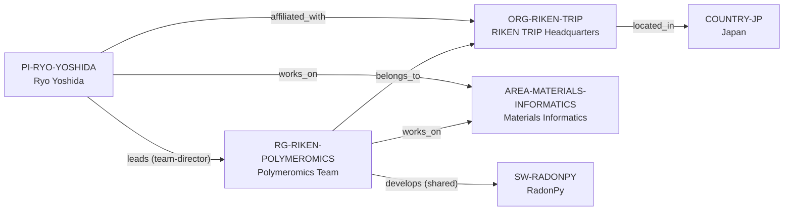

# RIKEN Polymeromics–Yoshida vertical slice

> **Status:** tenth reviewed vNext vertical slice, reviewed 2026-07-12.

## Purpose and scope

This bounded Quality Gate 1 slice resolves the Ryo Yoshida anchor into a
current RIKEN Transformative Research Innovation Platform of RIKEN (TRIP)
chain. It adds RIKEN TRIP Headquarters, the Polymeromics Team, Ryo Yoshida,
and RadonPy while reusing Japan and the Materials Informatics area.

The slice preserves role granularity: RIKEN identifies Yoshida as Team Director,
while the Polymeromics Team page identifies RadonPy as a team output and related
GitHub resource. The group therefore receives a bounded, non-exclusive software
development relation; the PI is not labeled a maintainer or individual developer
without source-specific evidence for that role.

## Canonical graph

| Role | Canonical record | Scope |
| --- | --- | --- |
| Principal investigator | [`PI-RYO-YOSHIDA`](../entities/principal-investigators/ryo-yoshida.md) | Current TRIP affiliation, Polymeromics Team leadership, and materials-informatics connection. |
| Research group | [`RG-RIKEN-POLYMEROMICS`](../entities/research-groups/riken-polymeromics-team.md) | Named TRIP-hosted group, its stated automated-simulation/AI work, and bounded RadonPy connection. |
| Organization | [`ORG-RIKEN-TRIP`](../entities/organizations/riken-trip-headquarters.md) | Non-university direct host for the team. |
| Country | [`COUNTRY-JP`](../entities/countries/japan.md) | Existing geographic endpoint for TRIP. |
| Research software | [`SW-RADONPY`](../entities/research-software/radonpy.md) | Open-source polymer-informatics automation software. |
| Research area | [`AREA-MATERIALS-INFORMATICS`](../entities/research-areas/materials-informatics.md) | Existing controlled area reused by the PI and group. |

## Contract and evidence checks

| Rule | Result in this slice |
| --- | --- |
| Accepted direct-host rule | `RG-RIKEN-POLYMEROMICS` has `organization_id: ORG-RIKEN-TRIP`, no `institution_id`, and a matching evidence-bearing `belongs_to` assertion. |
| Group versus individual software role | The official team page supports a group-level RadonPy relation. It does not identify an individual maintenance role for Yoshida, so no PI-to-software edge is asserted. |
| Software evidence | RadonPy's repository provides an independent public description and BSD-3-Clause license; the RIKEN team page supplies its bounded group context. |
| Evidence before inference | Reviewed records and assertions use record-local `SRC-*` keys resolved in their own Evidence tables. |
| Legacy preservation | The v1 Yoshida dossier remains a dated applicant-oriented analysis and points to, but is not merged into, the canonical PI record. |

## Deliberate omissions

- No individual RadonPy maintainer, owner, or developer claim is inferred from
  authorship, team directorship, or the group’s software connection.
- No Polymeromics ecosystem, database, foundation model, robot, project,
  funder, participant, or additional-person record is created without an
  independently reviewed identity and relationship.
- No team recruitment notice is converted into a generic current opening or a
  graduate degree route.
- No claim is made about supervision capacity, mentoring, admissions, funding,
  language, ranking, or applicant fit.

## View reachability

No generated view output is added. The documented graph supports these future
traversals without copying profiles into views:

| View family | Traversal |
| --- | --- |
| Global | Reviewed `PI-RYO-YOSHIDA`, `RG-RIKEN-POLYMEROMICS`, and `SW-RADONPY` are available when a generator implements the declared query. |
| Country | `RG-RIKEN-POLYMEROMICS` → `ORG-RIKEN-TRIP` → `COUNTRY-JP`. |
| Research area | PI or group → `works_on` → `AREA-MATERIALS-INFORMATICS`. |
| Research software | `RG-RIKEN-POLYMEROMICS` → `develops` → `SW-RADONPY`, explicitly bounded as a shared group-level connection. |

The review and validation record is in
[RIKEN Polymeromics–Yoshida vertical slice review](../reports/riken-polymeromics-vertical-slice-review.md).
