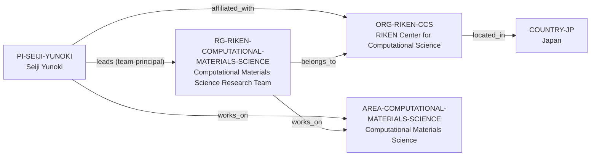

# RIKEN Computational Materials Science–Yunoki vertical slice

> **Status:** ninth reviewed vNext vertical slice, reviewed 2026-07-12.

## Purpose and scope

This bounded Quality Gate 1 slice resolves the Seiji Yunoki anchor into a
current RIKEN Center for Computational Science (R-CCS) chain. It adds Japan,
the R-CCS organization, the Computational Materials Science Research Team, and
Seiji Yunoki while reusing the existing Computational Materials Science area.

The team’s current public material establishes a direct research-group host,
team-principal role, and numerical-methods work in materials and quantum
systems. Although the page discusses software applications, it does not identify
a named maintained software artifact; this slice therefore adds no software,
ecosystem, or maintainer relationship by inference.

## Canonical graph

| Role | Canonical record | Scope |
| --- | --- | --- |
| Principal investigator | [`PI-SEIJI-YUNOKI`](../entities/principal-investigators/seiji-yunoki.md) | Current R-CCS affiliation, team leadership, and computational-materials connection. |
| Research group | [`RG-RIKEN-COMPUTATIONAL-MATERIALS-SCIENCE`](../entities/research-groups/riken-computational-materials-science-team.md) | Named R-CCS team and its stated numerical-methods research. |
| Organization | [`ORG-RIKEN-CCS`](../entities/organizations/riken-center-for-computational-science.md) | Non-university direct host for the team. |
| Country | [`COUNTRY-JP`](../entities/countries/japan.md) | Geographic endpoint for R-CCS. |
| Research area | [`AREA-COMPUTATIONAL-MATERIALS-SCIENCE`](../entities/research-areas/computational-materials-science.md) | Existing controlled area reused by the PI and group. |

## Contract and evidence checks

| Rule | Result in this slice |
| --- | --- |
| Accepted direct-host rule | `RG-RIKEN-COMPUTATIONAL-MATERIALS-SCIENCE` has `organization_id: ORG-RIKEN-CCS`, no `institution_id`, and a matching evidence-bearing `belongs_to` assertion. |
| Current role boundary | The PI record covers the direct R-CCS team role only; other RIKEN affiliations listed on the individual page remain unmodeled until their host identities and relevance are separately reviewed. |
| No software inference | A reference to software applications in the research summary is insufficient to create a named software record, group development edge, or individual maintainer claim. |
| Evidence before inference | Reviewed records and assertions use record-local `SRC-*` keys resolved in their own Evidence tables. |
| Legacy preservation | The v1 Yunoki dossier remains a dated applicant-oriented analysis and points to, but is not merged into, the canonical PI record. |

## Deliberate omissions

- No named software, software-development, maintenance, or ecosystem relation
  is created from the team’s generic software-application statement.
- No other Yunoki RIKEN affiliation, laboratory, organization, project,
  funding-programme, participant, or publication node is created without an
  independently reviewed identity and relationship.
- No current R-CCS job or internship notice is treated as a Yunoki-team opening
  or a graduate degree route.
- No claim is made about supervision capacity, mentoring, admissions, funding,
  language, ranking, or applicant fit.

## View reachability

No generated view output is added. The documented graph supports these future
traversals without copying profiles into views:

| View family | Traversal |
| --- | --- |
| Global | Reviewed `PI-SEIJI-YUNOKI`, `RG-RIKEN-COMPUTATIONAL-MATERIALS-SCIENCE`, and `ORG-RIKEN-CCS` are available when a generator implements the declared query. |
| Country | `RG-RIKEN-COMPUTATIONAL-MATERIALS-SCIENCE` → `ORG-RIKEN-CCS` → `COUNTRY-JP`. |
| Research area | PI or group → `works_on` → `AREA-COMPUTATIONAL-MATERIALS-SCIENCE`. |
| Software | No software traversal is asserted until a separately identified artifact and stewardship relationship have primary evidence. |

The review and validation record is in
[RIKEN Computational Materials Science–Yunoki vertical slice review](../reports/riken-yunoki-vertical-slice-review.md).
