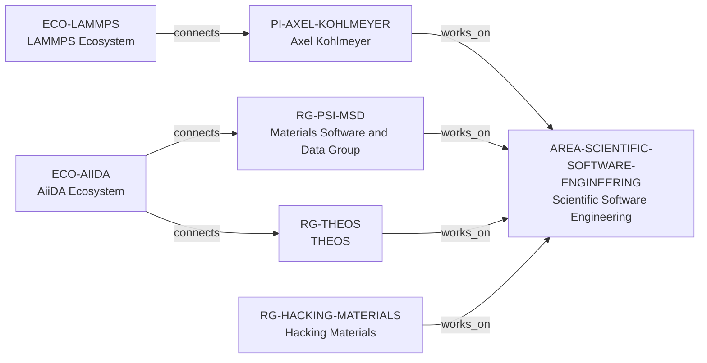

# Scientific Software Engineering area vertical slice

> **Status:** reviewed controlled-area extension, reviewed 2026-07-13.

## Purpose and scope

This slice makes Scientific Software Engineering a controlled research area in
the canonical graph. It classifies only records whose own public sources
describe scientific-software development, engineering, maintenance, or shared
research-infrastructure contribution. It intentionally does not classify every
group that merely uses a public code, performs high-performance computing, or
works in Computational Materials Science.

## Canonical graph

## Evidence matrix

| Entity | Direct public evidence used | Boundary |
| --- | --- | --- |
| Axel Kohlmeyer | Temple explicitly describes scientific-software development and engineering as a research interest. | No claim about every software package, supervision, availability, or fit. |
| Materials Software and Data Group | PSI describes advanced simulation software/algorithms and group-led AiiDA-engine development. | No claim that every member or activity is software engineering. |
| THEOS | EPFL describes shared contribution to open-source electronic-structure and materials-informatics infrastructure. | No exclusive ownership or individual engineering-role claim. |
| Hacking Materials | Group material describes community data/software infrastructure and AMSET group-led development. | No group-wide engineering or software-quality claim. |

## Deterministic discovery

The versioned evidence model provides four non-comparative query surfaces:

- `groups-scientific-software-engineering`
- `principal-investigators-scientific-software-engineering`
- `ecosystems-scientific-software-engineering`
- `universities-hosting-scientific-software-engineering-groups`

Each result displays the exact sourced path. None is a software-maturity,
research-quality, mentorship, admissions, funding, availability, or applicant-
fit ranking.

## Deliberate omissions

- No hierarchy is imposed between Scientific Software Engineering and
  Computational Materials Science, Materials Informatics, or AI for Materials.
- Public repositories, tools in a methods section, HPC use, data work, and
  software-adjacent teaching are not sufficient by themselves for this area.
- No new programming-language, project, dataset, contributor, or software
  entity is created solely from these classifications.

The review record is in [Scientific Software Engineering area vertical slice
review](../reports/scientific-software-engineering-area-vertical-slice-review.md).
