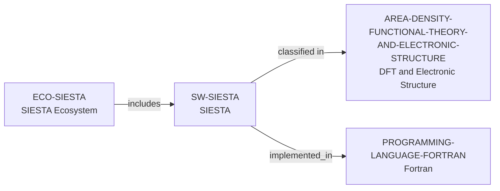

# SIESTA ecosystem vertical slice

> **Status:** reviewed Quality Gate 3 vertical slice, reviewed 2026-07-13.

## Purpose and scope

This slice adds separate SIESTA software and ecosystem records and reuses the
controlled Fortran and DFT/Electronic Structure records. It establishes only
the directly sourced first-principles/DFT scope, GPLv3 distribution, Fortran
2003 implementation, and public installation/contribution surfaces. It
intentionally introduces no person, institution, funder, or complete
developer-community record.

## Canonical graph



## Evidence boundaries

| Dimension | Canonical evidence | Boundary |
| --- | --- | --- |
| Software scope | Official source and reference material describe first-principles electronic-structure calculations using DFT. | No conclusion is made about performance, method suitability, or every SIESTA capability. |
| Openness and delivery | The official GitLab project displays GNU GPLv3 licensing; project documentation provides source and package installation paths. | Public source does not promise current support, availability, or a particular environment. |
| Implementation language | The official reference manual explicitly states Fortran 2003. | This is a software implementation fact only, not a person-level skill or an assertion about every auxiliary artifact. |
| Contribution surface | Project guidance documents GitLab forking, upstream synchronization, and merge requests. | These routes do not promise account access, acceptance, review, response, mentoring, or membership. |

## Deliberate omissions

- No individual developer, maintainer, reviewer, employer, institution,
  funder, module, dependency, extension, benchmark, event, or user is modeled
  without separately reviewed evidence.
- No lifecycle state is inferred from repository activity; software discovery
  continues to display `not documented` for that dimension where appropriate.
- No claim is made about quality, scaling, correctness, support, openings,
  mentorship, admissions, or applicant fit.

## View reachability

The public software and ecosystem views expose the canonical records. This
interactive query requires four independently documented facts and returns
SIESTA with each matching source path:

```bash
python3 scripts/research_landscape.py discover-software \
  --area AREA-DENSITY-FUNCTIONAL-THEORY-AND-ELECTRONIC-STRUCTURE \
  --language PROGRAMMING-LANGUAGE-FORTRAN \
  --ecosystem ECO-SIESTA \
  --open-source yes
```

This is evidence discovery, not a language-based suitability, quality, or
career recommendation.

The review record is in [SIESTA ecosystem vertical slice
review](../reports/siesta-ecosystem-vertical-slice-review.md).
