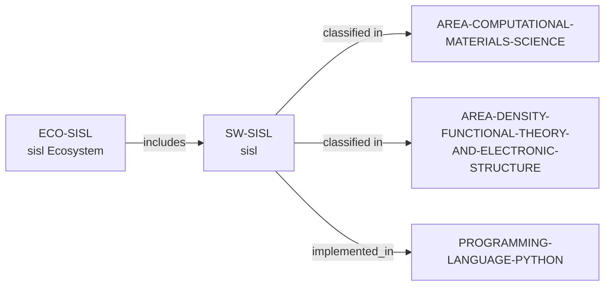

# sisl ecosystem vertical slice

> **Status:** reviewed vertical slice, reviewed 2026-07-13.

## Scope

This slice adds separate sisl software and ecosystem records. It reuses the
controlled Python, Computational Materials Science, and DFT/Electronic
Structure records; it establishes only open DFT-analysis and tight-binding
scope, MPL-2.0 licensing, Python implementation, and public project surfaces.

## Canonical graph

## Evidence boundaries

| Dimension | Canonical evidence | Boundary |
| --- | --- | --- |
| Software scope and openness | Official repository | No claim about method completeness, accuracy, or performance. |
| License and implementation | Repository displays MPL-2.0 and identifies an electronic-structure Python package | Implementation is a software fact only. |
| Participation | Public documentation, issues, discussions, tutorials, and contribution guide | These routes do not promise access, review, response, support, or mentoring. |

## Deliberate omissions

- Documented external-code interoperability remains prose because the graph has
  no safe dependency predicate.
- No contributor, maintainer, institution, funding, support, lifecycle,
  quality, admissions, or applicant-fit claim is inferred.

The review record is in [sisl ecosystem vertical slice review](../reports/sisl-ecosystem-vertical-slice-review.md).
