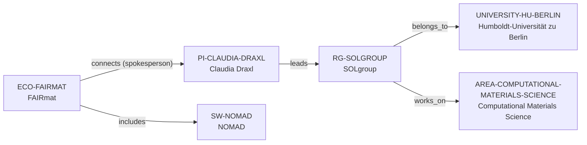

# SOLgroup intelligence vertical slice

> **Status:** sixth reviewed Quality Gate 4 Research Group Intelligence slice, reviewed 2026-07-12.

## Purpose and scope

This Quality Gate 4 slice deepens the existing SOLgroup record without creating
a duplicate laboratory profile, people registry, project catalog, software
catalog, or career ranking. It captures first-party evidence for research
programs, `exciting`/CELL development, public open-source context, people and
former-member surfaces, publications, student-topic discovery, and GraFOx
partnership context.

The current group site presents a computational solid-state-theory environment
covering theoretical spectroscopy, electron-phonon coupling, interfaces,
nanostructures, thermoelectricity, wide-gap oxides, and solar-cell materials.
It identifies SOLgroup as the core developer team of `exciting` and CELL; the
official `exciting` project identifies `exciting` as GPL-licensed open-source
software. This is group/software evidence, not a reason to create unreviewed
software records, claim every member maintains either codebase, or extend the
existing graph to all named infrastructure.

## Canonical graph

The slice creates no speculative people, alumni, software, project, funder,
collaborator, facility, or industry nodes. Existing canonical records retain
the graph; the group record gains evidence-bounded context only.

## QG4 coverage matrix

| Required group dimension | Canonical evidence in this slice | Boundary |
| --- | --- | --- |
| Research themes | The group describes theoretical spectroscopy, electron-phonon coupling, interfaces, nanostructures, thermoelectricity, oxides, and solar-cell materials. | Stated programs, not a complete taxonomy or every member’s work. |
| Scientific software maturity | SOLgroup calls itself the core developer team of `exciting` and CELL and describes DFT/beyond-DFT implementation areas. | No lifecycle rating, individual maintenance role, governance model, or all-software claim. |
| Programming stack | Public sources describe source management, build, tests, and tutorials for `exciting`. | No reliable group-wide language policy or programming-language identifier. |
| Software ecosystem participation | The group contextualizes NOMAD/FAIRmat and is the stated core developer team for `exciting`/CELL. | Existing FAIRmat/NOMAD graph edges remain unchanged. |
| Open-source activity | The official `exciting` page describes GPL licensing, source management, automated tests, and tutorials. | This applies to `exciting`, not necessarily CELL or every group output. |
| Students, postdocs, and staff | The group displays a current roster and a dated former-member archive with role categories and periods. | Not a complete employment ledger, headcount, or basis for bulk person entities. |
| Funding | GraFOx is named as a partnership. | No current award-by-award group funding ledger or funding edge is inferred. |
| Infrastructure | Sources describe advanced DFT/beyond-DFT methods, code, and documentation. | No dedicated-hardware, allocation, access, or availability claim. |
| Major projects | The group calls itself a main GraFOx partner and lists technical programs and student topics. | Not a canonical Project entity or governance record. |
| Collaboration | GraFOx and NOMAD/FAIRmat provide named context. | No complete institutional, international, industry, or partner graph. |
| Publication patterns | A chronological peer-reviewed list includes dated current entries and DOI/data links. | No count, productivity, quality, attribution, or causal metric. |
| Mentorship evidence | Student-topic discovery and thesis/archive surfaces are public. | Not measured mentorship, individual supervision, admission, or capacity evidence. |
| Career outcomes | Former-member material records roles and time spans. | No placement rate, causal claim, typical outcome, or guarantee. |

## Evidence-bounded research environment

SOLgroup’s public material combines foundational theory with community software
and data-infrastructure context. Its code-development page links all-electron
DFT, time-dependent DFT, many-body perturbation theory, and spectroscopy to
core development of `exciting` and CELL. The official `exciting` project
supplies independent evidence of GPL-licensed open-source software with source
management, automated tests, and tutorials.

The roster, former-member archive, publication list, thesis sections, and
student-topic page improve diligence without becoming rankings or live
recruitment claims. GraFOx is concrete external research context, but not a
complete collaboration or funding graph. Topic availability, eligibility,
funding, and supervisor capacity must be checked at the time of inquiry.

## Deliberate omissions

- No individual member, alum, collaborator, funder, industry partner, project,
  facility, software package, or workflow is created without separate identity
  and relationship evidence.
- No live opening, admission, compensation, funding, supervision capacity,
  language, or applicant-fit claim is made.
- No group-wide NOMAD/FAIRmat ownership, governance, maintenance, license, or
  individual-contributor claim is inferred from public contextual material.
- No group-wide publication-quality, management, culture, mentoring-quality,
  collaboration, or career-outcome rating is calculated or implied.

## View reachability

No generated view output is added. The enriched group record supports these
future evidence-led traversals without copied facts:

| View family | Traversal |
| --- | --- |
| Research group | `RG-SOLGROUP` → Humboldt host, computational-materials area, and PI leader. |
| Software diligence | Source-backed `exciting`/CELL development plus `exciting`’s public open-source surface, without unreviewed nodes. |
| People and output diligence | Source-backed roster/history and chronological publication surfaces, each preserving completeness limits. |
| Project and collaboration diligence | GraFOx partnership and student-topic context without a speculative project, funder, or partner graph. |

The review and validation record is in [SOLgroup intelligence vertical slice
review](../reports/solgroup-intelligence-vertical-slice-review.md).
