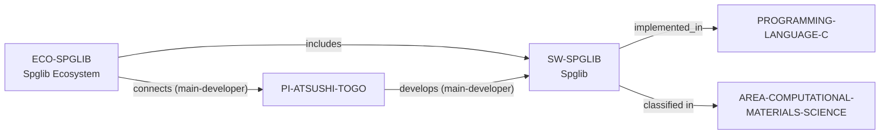

# Spglib ecosystem vertical slice

> **Status:** reviewed vertical slice, reviewed 2026-07-13.

This slice adds distinct Spglib software, ecosystem, and controlled C-language
records. It establishes only BSD-3-Clause C crystal-symmetry-library scope,
public source and contribution routes, and a bounded current-main-developer
connection to Atsushi Togo.

Spglib's documented Python, Fortran, Rust, and Ruby interfaces remain context,
not implementation-language or dependency assertions. Public source, issues,
pull requests, and discussions do not establish acceptance, support,
governance, mentoring, funding, admissions, or applicant fit.

The review record is in [Spglib ecosystem vertical slice review](../reports/spglib-ecosystem-vertical-slice-review.md).
