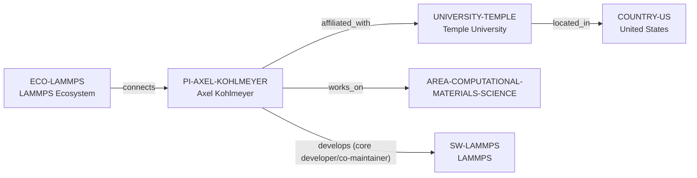

# Temple–Kohlmeyer–LAMMPS vertical slice

> **Status:** reviewed Quality Gate 2 extension, reviewed 2026-07-13.

## Purpose and scope

This slice adds the first independently reviewed academic person path to the
existing LAMMPS ecosystem: Axel Kohlmeyer, Temple University, and the United
States. The public evidence supports his research-faculty affiliation,
scientific-software and molecular-dynamics research connection, and current
LAMMPS core-developer/co-maintainer role.

## Canonical graph

## Evidence and boundaries

| Dimension | Canonical evidence | Boundary |
| --- | --- | --- |
| Affiliation | Temple identifies Kohlmeyer as Full Professor of Research in Philadelphia. | It does not establish current openings, student supervision, admissions, or programme eligibility. |
| Research connection | Temple describes scientific-software engineering and molecular-dynamics simulation research; LAMMPS lists materials-science expertise. | This is not an exhaustive research profile or a claim about every software package named on the profile. |
| LAMMPS role | Temple calls him a core developer/co-maintainer; LAMMPS lists him among current core developers. | It does not establish sole ownership, every release/review assignment, support commitment, or contribution frequency. |
| University and country | Temple's official contact page locates the University in Philadelphia, United States. | Geography is a filter, not a quality or mobility conclusion. |

## Deliberate omissions

- No Temple HPC Team, Institute, department, ICTP, additional software, student,
  contributor, funding, or project entity is created without an independently
  reviewed canonical identity and relationship.
- No claim is made about supervision, mentoring, openings, admissions, funding,
  working language, rank, or personal fit.

The review record is in [Temple–Kohlmeyer–LAMMPS vertical slice review](../reports/temple-kohlmeyer-lammps-vertical-slice-review.md).
