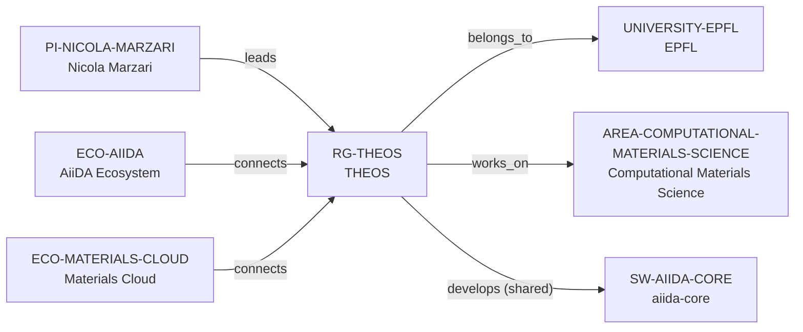

# THEOS intelligence vertical slice

> **Status:** fifth reviewed Quality Gate 4 Research Group Intelligence slice, reviewed 2026-07-12.

## Purpose and scope

This Quality Gate 4 slice deepens the existing Laboratory of Theory and
Simulation of Materials (THEOS) record without creating a duplicate laboratory
profile, people registry, project catalog, or career ranking. It captures
first-party evidence for research programs, shared open-source infrastructure,
public education/outreach, and bachelor/master project-discovery routes, while
retaining clear limits for people, funding, collaborations, and outcomes.

THEOS publicly describes first-principles modelling and high-throughput design
of materials and devices, with energy and information/communication research
programs. It also describes contributions to open-source electronic-structure
and materials-informatics infrastructure, and a teaching/outreach surface that
includes classes, schools, workshops, online material, and hands-on
computational labs. These are group-level research and learning signals—not a
complete programming stack, roster, funding ledger, hardware allocation, or
supervision guarantee.

## Canonical graph

The slice creates no speculative people, alumni, software, project, funder,
collaborator, facility, or industry nodes. Existing canonical records retain
the graph; the group record gains evidence-bounded context only.

## QG4 coverage matrix

| Required group dimension | Canonical evidence in this slice | Boundary |
| --- | --- | --- |
| Research themes | THEOS describes first-principles modelling, high-throughput design, energy harvesting/conversion/storage, and information/communication materials and devices. | These are stated group programs, not a complete taxonomy or every member’s topic. |
| Scientific software maturity | The group identifies open-source infrastructure contributions spanning electronic-structure modelling and materials informatics, including AiiDA and Materials Cloud. | This does not establish lifecycle ratings, individual maintenance, exclusive ownership, or governance. |
| Programming stack | Sources name computational methods and public software infrastructure. | They provide no reliable group-wide language policy; no programming-language identifier is inferred. |
| Software ecosystem participation | Existing shared AiiDA development and AiiDA/Materials Cloud ecosystem connections remain canonical. | Additional named infrastructures are not converted into entities or group relationships without separate review. |
| Open-source activity | THEOS explicitly describes contribution to development and maintenance of open-source computational infrastructures. | This is group-level stated activity, not a license, code-review, release, or contributor-rights claim for every output. |
| Students, postdocs, and staff | EPFL’s public THEOS pages do not provide a stable, accessible current roster in the reviewed surface. | No people count, role roster, or bulk person entities are inferred. |
| Funding | The reviewed pages establish no current award-by-award group funding ledger. | No funder, programme, award, amount, or funding edge is inferred. |
| Infrastructure | The group describes large-scale/high-throughput calculations and computational methods. | These methods do not prove dedicated hardware, allocation, access, availability, or support commitments. |
| Major projects | The public pages provide bachelor/master project-discovery routes and named technical programs. | A route or topic does not establish a currently available project or a canonical Project entity. |
| International and experimental collaboration | THEOS states that its computational work is validated against experiment and that knowledge is shared with collaborators and the broader scientific community. | No complete collaborator, institution, international, industry, or partner graph is claimed. |
| Publication patterns | Reviewed THEOS pages focus on research, teaching, and linked wiki surfaces rather than a verified current internal publication inventory. | No publication count, quality, productivity, or attribution metric is made. |
| Mentorship evidence | THEOS describes knowledge transfer through classes, schools, workshops, online materials, and hands-on computational labs. | These are public educational/outreach activities, not proof of individual supervision, mentoring quality, or capacity. |
| Career outcomes | No reviewed first-party THEOS source provides an alumni-outcomes surface. | No placement rate, causal claim, typical outcome, or guarantee is inferred. |

## Evidence-bounded research environment

THEOS makes its intellectual and infrastructure environment highly legible:
first-principles, high-throughput, method-development, and device/material
research appear alongside a shared contribution to community computational
infrastructure. The research page explicitly connects calculations to
experimental validation and higher-order theories, which clarifies the group’s
methodological orientation without asserting a partner inventory.

The education material gives a prospective researcher useful evidence of a
public computational-learning surface, including a course with four hands-on
labs and group outreach through schools, workshops, and online materials. The
student-project pages are discovery routes only; the linked wiki is the place
to verify a project, its availability, eligibility, or funding at the time of
inquiry.

## Deliberate omissions

- No individual member, alum, collaborator, funder, industry partner, project,
  facility, codebase, or workflow is created without separate identity and
  relationship evidence.
- No live opening, admission, compensation, funding, supervision capacity,
  language, or applicant-fit claim is made.
- No claim about exclusive ownership, maintenance, governance, release process,
  license administration, or every member’s role is inferred from shared
  open-source infrastructure contributions.
- No group-wide publication-quality, management, culture, mentoring-quality,
  collaboration, or career-outcome rating is calculated or implied.

## View reachability

No generated view output is added. The enriched group record supports these
future evidence-led traversals without copied facts:

| View family | Traversal |
| --- | --- |
| Research group | `RG-THEOS` → EPFL host, computational-materials area, and PI leader. |
| Software ecosystem | THEOS → shared aiida-core development and AiiDA/Materials Cloud ecosystem connections. |
| Learning and project diligence | Source-backed courses, outreach, and student-project discovery routes, each preserving live-availability limits. |
| Collaboration diligence | Source-backed experimental-validation and outreach context without a speculative partner graph. |

The review and validation record is in [THEOS intelligence vertical slice
review](../reports/theos-intelligence-vertical-slice-review.md).
