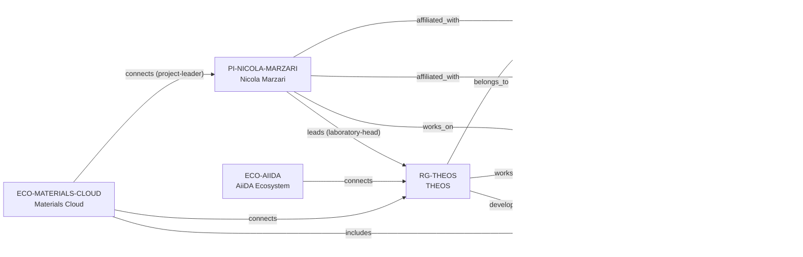

# THEOS–EPFL / Materials Cloud vertical slice

> **Status:** seventh reviewed vNext vertical slice, reviewed 2026-07-12.

## Purpose and scope

This bounded Quality Gate 1 slice resolves the Nicola Marzari anchor into a
current, evidence-first Swiss graph. It adds EPFL, the Laboratory of Theory and
Simulation of Materials (THEOS), Nicola Marzari, and Materials Cloud, while
reusing Switzerland, PSI, AiiDA, `aiida-core`, and Computational Materials
Science.

The public evidence documents current EPFL and PSI roles in July 2026, and a
separately announced Cambridge appointment beginning in September 2026. The
slice models only the current state. It also distinguishes Materials Cloud as a
research ecosystem from AiiDA as software and an ecosystem, and models THEOS's
contribution to both infrastructures as shared rather than exclusive.

## Canonical graph

| Role | Canonical record | Scope |
| --- | --- | --- |
| Principal investigator | [`PI-NICOLA-MARZARI`](../entities/principal-investigators/nicola-marzari.md) | Current EPFL/PSI affiliations, THEOS leadership, and computational-materials connection. |
| Research group | [`RG-THEOS`](../entities/research-groups/theos.md) | Named EPFL group, its stated research methods, and shared AiiDA contribution. |
| University | [`UNIVERSITY-EPFL`](../entities/universities/epfl.md) | Direct University host for THEOS. |
| Research ecosystem | [`ECO-MATERIALS-CLOUD`](../entities/ecosystems/materials-cloud.md) | Open computational-materials ecosystem, distinct from AiiDA. |
| Existing organization | [`ORG-PSI`](../entities/organizations/paul-scherrer-institute.md) | Current PSI affiliation endpoint only; no new PSI laboratory node is introduced. |
| Existing software and ecosystem | [`SW-AIIDA-CORE`](../entities/research-software/aiida-core.md), [`ECO-AIIDA`](../entities/ecosystems/aiida.md) | Reused for the documented shared THEOS contribution. |
| Existing country and research area | [`COUNTRY-CH`](../entities/countries/switzerland.md), [`AREA-COMPUTATIONAL-MATERIALS-SCIENCE`](../entities/research-areas/computational-materials-science.md) | Reused geographic and topical endpoints. |

## Contract and evidence checks

| Rule | Result in this slice |
| --- | --- |
| Accepted direct-host rule | `RG-THEOS` has `institution_id: UNIVERSITY-EPFL`, no `organization_id`, and a matching evidence-bearing `belongs_to` assertion. |
| Current-state boundary | EPFL and PSI affiliations are modeled from current sources; the public September 2026 Cambridge appointment is expressly not modeled as current affiliation. |
| Infrastructure distinction | Materials Cloud is a separate ecosystem; it includes `SW-AIIDA-CORE` because its official site describes it as powered by AiiDA, without equating the two. |
| Shared contribution | THEOS's `develops → SW-AIIDA-CORE` and ecosystem connections explicitly record a shared contribution, not exclusive development, ownership, or individual maintainer status. |
| Evidence before inference | Reviewed records and assertions use record-local `SRC-*` keys resolved in their own Evidence tables. |
| Legacy preservation | The v1 Marzari dossier remains a dated applicant-oriented analysis and now points to, rather than duplicates, the canonical PI record. |

## Deliberate omissions

- No University of Cambridge entity or current Marzari affiliation is created
  from an appointment scheduled to begin in September 2026.
- No NCCR MARVEL funding-programme, project, or governance record is created
  solely from the director title.
- No PSI Laboratory for Materials Simulations research-group node is created;
  the reviewed source supports Marzari's affiliation and laboratory-head role,
  while the minimum current graph needs no duplicate or overlapping group.
- No exclusive ownership, hosting, or individual maintainer claim is made for
  AiiDA or Materials Cloud.
- No claim is made about current openings, supervision capacity, mentoring,
  admissions, funding, language, ranking, or applicant fit.

## View reachability

No generated view output is added. The documented graph supports these future
traversals without copying profiles into views:

| View family | Traversal |
| --- | --- |
| Global | Reviewed `PI-NICOLA-MARZARI`, `RG-THEOS`, `UNIVERSITY-EPFL`, and `ECO-MATERIALS-CLOUD` are available when a generator implements the declared query. |
| Country and University | `RG-THEOS` → `UNIVERSITY-EPFL` → `COUNTRY-CH`; PI → `affiliated_with` → either current host. |
| Research area | PI or group → `works_on` → `AREA-COMPUTATIONAL-MATERIALS-SCIENCE`. |
| Software and ecosystem | THEOS → `develops` → `SW-AIIDA-CORE`; Materials Cloud → `includes` → `SW-AIIDA-CORE`; either ecosystem → `connects` → THEOS. |

The review and validation record is in
[THEOS–EPFL / Materials Cloud vertical slice review](../reports/theos-vertical-slice-review.md).
