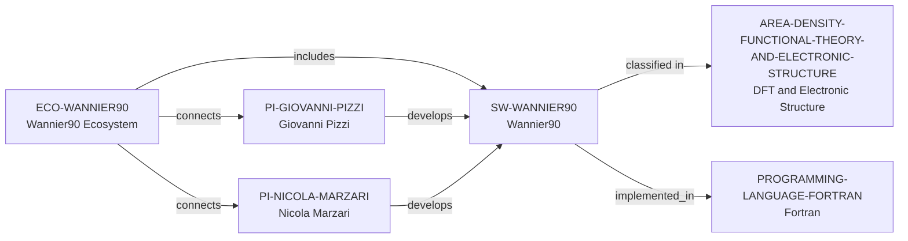

# Wannier90 ecosystem vertical slice

> **Status:** reviewed Quality Gate 3 vertical slice, reviewed 2026-07-13.

## Purpose and scope

This slice adds distinct Wannier90 software and ecosystem records, reuses the
controlled Fortran and DFT/Electronic Structure records, and adds only the
officially listed developer-group paths for existing PIs Giovanni Pizzi and
Nicola Marzari. It establishes direct scope, LGPL-2.1-or-later licensing,
Fortran-library implementation, and public contribution/learning context.

## Canonical graph



## Evidence boundaries

| Dimension | Canonical evidence | Boundary |
| --- | --- | --- |
| Software scope | Official Wannier90 material describes maximally-localized Wannier functions and electronic properties of materials. | No conclusion is made about every interfacing code, workflow, or property. |
| Openness and delivery | The official repository identifies LGPL-2.1-or-later licensing and links contribution/issue guidance. | Public source does not promise support, availability, or a particular environment. |
| Implementation language | Official library documentation describes a Fortran library interface. | This is a software implementation fact only, not a person-level skill or every auxiliary interface. |
| Developer-group paths | The official repository lists Pizzi and Marzari in the Developer Group. | This does not establish exclusive ownership, maintainer assignment, review authority, employment, or contribution frequency. |

## Deliberate omissions

- No other Developer Group member, contributor, institution, funder, interface,
  application, release, test, event, or user is modeled without separately
  reviewed identity and relationship evidence.
- The broad published registry of related software remains prose context; the
  current relationship contract has no safe software-dependency or
  ecosystem-to-ecosystem predicate.
- No claim is made about quality, scaling, correctness, support, openings,
  mentorship, admissions, or applicant fit.

## View reachability

The public software and ecosystem views expose the canonical records. This
interactive query requires four independently documented facts and returns
Wannier90 with each matching source path:

```bash
python3 scripts/research_landscape.py discover-software \
  --area AREA-DENSITY-FUNCTIONAL-THEORY-AND-ELECTRONIC-STRUCTURE \
  --language PROGRAMMING-LANGUAGE-FORTRAN \
  --ecosystem ECO-WANNIER90 \
  --open-source yes
```

This is evidence discovery, not a language-based suitability, quality, or
career recommendation.

The review record is in [Wannier90 ecosystem vertical slice
review](../reports/wannier90-ecosystem-vertical-slice-review.md).
