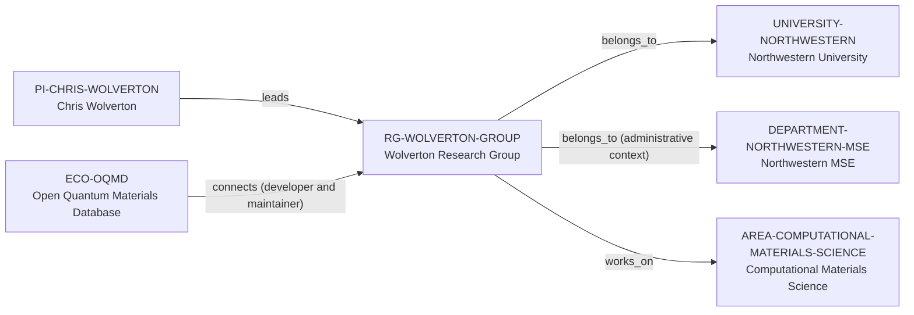

# Wolverton Research Group intelligence vertical slice

> **Status:** second reviewed Quality Gate 4 Research Group Intelligence slice, reviewed 2026-07-12.

## Purpose and scope

This Quality Gate 4 slice deepens the existing Wolverton Research Group record
without creating a parallel lab profile, people registry, or career ranking. It
captures first-party evidence for research themes, OQMD stewardship, visible
role categories, technical methods, publication/news surface, selected public
alumni outcomes, and explicit funding/collaboration/mentoring evidence gaps.

The sources support a computational-materials and AI environment focused on
energy and sustainability, DFT, high-throughput methods, data-driven modelling,
machine learning, multiscale methods, and OQMD. They do not support a full
funding ledger, industry-partner inventory, collaboration graph, hardware
allocation, open-source governance, universal mentoring practice, or outcome
guarantee.

## Canonical graph

The slice adds no speculative people, alumni, projects, collaborators, funders,
software, or industry nodes. Existing canonical paths retain the factual graph;
group-level evidence augments their interpretation without duplicating data.

## QG4 coverage matrix

| Required group dimension | Canonical evidence in this slice | Boundary |
| --- | --- | --- |
| Research themes | Group sources identify energy/sustainability materials, batteries, catalysts, structural/functional materials, thermoelectrics, hydrogen storage, phase transformation, and microstructural evolution. | These are group scope, not every member’s topic or a complete taxonomy. |
| Scientific software maturity | The group describes developing and maintaining OQMD and using high-throughput predictive frameworks. | This does not create an unreviewed OQMD backend-software entity or make every member a maintainer. |
| Programming stack | Public sources describe technical methods but do not give a reliable group-wide language policy. | No programming-language fact or `programming_language_ids` value is inferred. |
| Software ecosystem participation | Existing `ECO-OQMD → connects → RG-WOLVERTON-GROUP` relation is retained with developer-and-maintainer evidence. | OQMD stewardship is group-level; individual maintenance is not inferred. |
| Open-source activity | OQMD public data access is documented at the ecosystem level. | No group-level source here establishes source-code publication, license, contribution workflow, or code-review practice. |
| Students, postdocs, and staff | The public members page names current postdoctoral and graduate categories, plus master and undergraduate sections and alumni. | This is a public roster, not a headcount, employment ledger, or basis for bulk entity creation. |
| Funding | One student profile describes work as part of a MURI, but no reliable group-level funding ledger is present. | No funder, programme, award, amount, or funding edge is inferred. |
| Infrastructure | Sources describe computational, high-throughput, and multiscale methods spanning DFT, ML, KMC, phase-field, CALPHAD, and related modelling. | These methods do not prove dedicated hardware, access, or software availability. |
| Major projects | OQMD and research programs in energy, batteries, thermoelectrics, nanoparticle/AI, phase stability, kinetics, and microstructure are documented. | Topics are not Projects until separately reviewed. |
| International and experimental collaboration | The public roster shows interdisciplinary backgrounds and the group describes predictive frameworks to guide experiments. | No complete international, experimental, institutional, or industry collaboration graph is claimed. |
| Publication patterns | Group news records dated paper announcements; member profiles and research pages provide technical context. | No publication count, quality score, productivity ranking, attribution, or causality is claimed. |
| Mentorship evidence | The members/news pages record student qualifications, thesis defenses, and fellowships. | These events do not prove mentoring quality, supervision practice, admissions policy, or current capacity. |
| Career outcomes | The alumni section gives selected subsequent positions across academia, research, engineering, and industry. | No placement rate, causal claim, typical outcome, or guarantee is inferred. |

## Evidence-bounded research environment

The group publicly frames its work around virtually designing and discovering
materials with first-principles, data-driven, machine-learning, and multiscale
methods. Its members page supports visible role categories and a broad technical
training surface: postdoctoral research, graduate research, master and
undergraduate participation, with individual project summaries spanning DFT,
transport, thermodynamics, machine learning, phase diagrams, interfaces, and
nanoparticles.

The public alumni and news sections are useful diligence signals because they
show selected, dated outcomes and student milestones. They are not statistical
evidence of placement, training quality, or causal group effects. The site's
welcome to prospective students is an invitation to explore the group, not a
current-openings or admissions statement.

## Deliberate omissions

- No individual member, alum, collaborator, funder, industry partner, project,
  facility, code, or workflow is created without separate identity and
  relationship evidence.
- No current-opening, admission, funding, compensation, supervision capacity,
  language, applicant-fit, or group-wide mentorship claim is made.
- No open-source, code-review, license, or backend-software claim is inferred
  from OQMD’s group-level stewardship or public data access.
- No group-wide publication-quality, management, culture, or career-outcome
  rating is calculated or implied.

## View reachability

No generated view output is added. The enriched group record supports these
future evidence-led traversals without copied facts:

| View family | Traversal |
| --- | --- |
| Research group | `RG-WOLVERTON-GROUP` → direct Northwestern host, administrative department context, computational-materials area, PI leader, and OQMD connection. |
| Data ecosystem | OQMD → Wolverton Group, with source-backed stewardship context and no backend-software duplication. |
| People and roles | Existing PI leadership plus source-backed role categories in canonical prose; individual records require separate review. |
| Career and opportunity diligence | Source-backed student milestones and selected alumni outcomes, each preserving time/scope limitations. |

The review and validation record is in [Wolverton Group intelligence vertical
slice review](../reports/wolverton-group-intelligence-vertical-slice-review.md).
