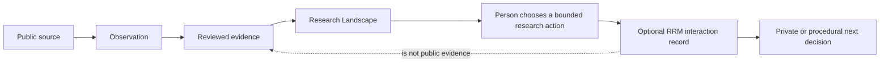
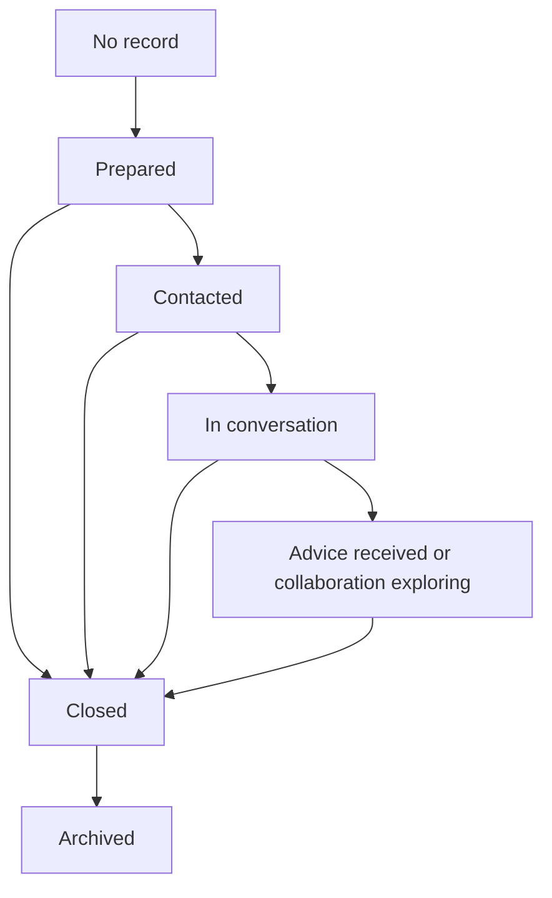

# RRM philosophy and lifecycle

## 1. What RRM is—and is not

Research Relationship Management (RRM) is a small, Markdown-first governance layer for **intentional research-related interactions**. Its job is to preserve the context needed to make an honest next decision after an interaction: whether to prepare, ask a focused question, wait for a stated next step, seek public evidence, or close the matter.

It is **not**:

- a CRM, networking tool, address book, recruitment pipeline, or outreach tracker;
- a database or application;
- a score of relationship quality, warmth, influence, prestige, or responsiveness;
- a substitute for consent, professional judgment, or formal admissions/collaboration processes; or
- a mechanism for inferring social connections from publications, affiliations, email addresses, or silence.

RRM must make relationships *less* extractive, not more efficient at collecting them. A contact is never a lead, a non-response is never a signal of quality, and an interaction is never a basis for a public reputation claim.

## 2. Why the boundary exists

Research Landscape is a public, evidence-first knowledge system. It models entities and typed factual relationships between stable IDs; its source material moves through observation, evidence, metric, dimension, score, and recommendation. [Relationship model](../docs/data-model/relationships.md) [Evidence model](../docs/methodology/evidence-model.md)

RRM is operational and deliberately narrow. It may record that an applicant sent a research-advice request, that a scoped conversation occurred, or that a next step was explicitly agreed. It does **not** decide whether an advisor is good, whether they are available in general, whether a department is strong, or whether the interaction validates a recommendation.

The dotted relationship is a prohibition, not a data flow: an interaction cannot enter the evidence pipeline automatically. If an interaction identifies a useful public source, that source begins again at **Observation**, with provenance and review.

## 3. Lifecycle

RRM has a purpose-limited lifecycle. A record should be created only when the next decision cannot be made from public evidence alone and a bounded interaction is justified.

### Phase 0 — no record

Begin with Research Landscape. A public advisor profile, report, or due-diligence dossier may recommend a careful conversation, but does not itself create an RRM record. `not_recorded` is the normal state for every entity and carries no interpretation.

### Phase 1 — prepare

Create a `prepared` record only after identifying:

- a research-specific purpose;
- the public evidence already reviewed;
- the concrete unknown to clarify; and
- the minimum respectful action that could clarify it.

Preparation is not permission to contact, and it is not a claim that a person is accepting students or seeking a collaborator.

### Phase 2 — contact

`contacted` means only that a documented, purpose-limited request was sent through an appropriate channel. It does not mean a reply is expected, a relationship exists, or the recipient has any obligation. Do not use timing or message frequency as a performance metric.

### Phase 3 — conversation

`in_conversation` means an actual, documented exchange is occurring. Store a minimal factual summary of agreed scope or next action, not a behavioral profile or an unconsented transcript. A person’s advice remains their advice; it is not a public assessment fact.

### Phase 4 — bounded outcome

An interaction can resolve as `advice_received` or `collaboration_exploring`. Both are deliberately modest:

- `advice_received` means a decision-relevant response was received and faithfully summarized;
- `collaboration_exploring` means a concrete possibility is being scoped, **not** that any agreement, funding, supervision, or commitment exists.

### Phase 5 — close and archive

Use `closed` when the record’s stated purpose has been answered, declined, superseded, or deliberately ended. Record a neutral reason category only if it is necessary for the next decision; do not retain personal speculation. `archived` is a preservation state after closure, not a claim that the relationship ended or deteriorated.

## 4. Relationship status semantics

| Status | Precise meaning | Does not mean | Valid evidence for a transition |
| --- | --- | --- | --- |
| `not_recorded` | No intentional RRM record exists. | No interest, no relationship, or a negative result. | None; it is the default. |
| `prepared` | Purpose, public context, and a bounded unknown are ready for a potential action. | Permission to contact or a predicted fit. | An explicit record author and stated research purpose. |
| `contacted` | A purpose-limited request was sent. | A reply, endorsement, or availability. | The sent action itself. |
| `in_conversation` | A substantive exchange is actually taking place. | A formal relationship, offer, or agreement. | A documented exchange or agreed meeting. |
| `advice_received` | Advice relevant to the stated purpose was received. | Proof of public facts, sponsorship, or supervision. | A faithful, minimal interaction note. |
| `collaboration_exploring` | A specific possible collaboration is being scoped. | A commitment, contract, funding, admission, or co-supervision. | An explicit scoped discussion. |
| `closed` | The purpose has ended or has no next action. | Rejection of a person or a permanent relationship judgment. | An explicit outcome, withdrawal, or purpose completion. |
| `archived` | A closed record is retained according to policy. | A live relationship state. | Closure plus a retention decision. |

### Transition rules

- Silence does not cause a transition. A record stays `contacted` until the author deliberately closes it for the stated purpose.
- A status change must refer to a dated interaction event or a deliberate closure decision; it must not be inferred from a person’s online activity.
- Do not skip directly from `prepared` to `collaboration_exploring` without an explicit scoped exchange.
- Reopen an archived record only when a new, stated research purpose justifies it; do not revive old notes for opportunistic networking.
- Status is never a ranking field and must not appear in Research Landscape scores, metrics, or public recommendations.

## 5. Evidence links and interaction links

The two link types look similar but have different epistemic roles.

| Link type | Points to | May support a public factual claim? | Typical use |
| --- | --- | --- | --- |
| **Evidence link** | A public, attributable source or a reviewed observation/evidence record. | Yes, after normal evidence review. | Support a claim about an entity, relationship, method, publication, or score input. |
| **Interaction link** | A deliberately created RRM interaction record or event reference. | No, not by itself. | Preserve the procedural context for a next action or closure. |

Examples of valid separation:

- An advisor’s official course page is an evidence link for a documented teaching claim.
- A research-advice meeting note is an interaction link for the decision “clarify capacity before applying.”
- A meeting may point to a new official project page; only that project page can enter the observation/evidence workflow.

Never write “the advisor confirmed they are a strong fit” as public evidence. At most, an interaction record may state that a person described a possible scope, subject to consent and normal process. Public reports require public, citable sources and review.

## 6. Markdown-first, scalable conventions

RRM is designed for scale without requiring a database or app:

- Markdown bodies should explain purpose, scope, factual interaction events, explicit next steps, and closure.
- Template metadata uses stable entity IDs rather than copied names or mutable contact details. See [stable identifiers](../docs/data-model/stable-identifiers.md).
- Future IDs must be permanent and non-semantic enough to survive renames or changing statuses; status must never be encoded into an ID or path.
- Use ISO 8601 dates and typed links (`evidence` versus `interaction`) so future validation can be deterministic.
- Preserve an event history rather than overwriting a past status; corrections should explain what changed and why.
- Keep names, sources, and uncertainty readable in the Markdown body. Machine fields validate shape; they do not prove consent, truth, or fit.
- If a future interaction must remain private, do not place personal/sensitive content in a public repository. Store only a minimal, shareable reference here—or do not create a repository record at all.

These conventions are compatible with the repository’s entity/relationship graph, but RRM records are not graph facts by default. [Entity model](../docs/data-model/entity-model.md)

## 7. Automation readiness and limits

Future automation may safely validate mechanical properties:

- valid stable IDs and links;
- allowed status values and transitions;
- date formats and chronological event ordering;
- missing required context fields once a schema is approved; and
- duplicate record identifiers.

Automation may not safely decide human facts. It must not infer consent, intent, sentiment, closeness, availability, response quality, or relationship value. It must not send messages, schedule reminders, scrape contact data, generate records from public pages, or promote interaction content into scores or evidence.

Any future schema, application, database, or integration requires a separate design decision and privacy review. The templates and prepared records in this module are governed by this philosophy; they do not introduce a database, application, or automation.

## 8. Practical decision rule

Use RRM only when all four answers are yes:

1. Is there a named research purpose rather than a generic networking goal?
2. Is the public evidence insufficient for a specific next decision?
3. Can the interaction be scoped respectfully and minimally?
4. Can its context be recorded without sensitive data, speculation, or an implied obligation?

If any answer is no, do not create a relationship record. Keep working in Research Landscape, improve the evidence, or let the matter rest.
