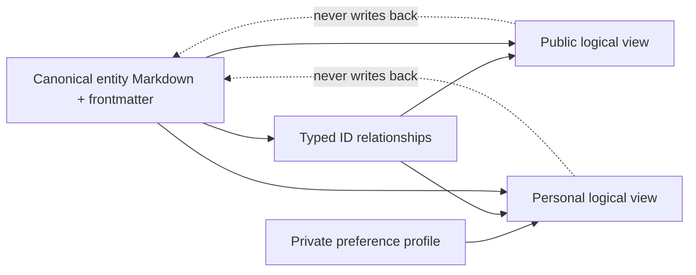

# Views

Views are reproducible navigation paths over canonical entity records. They let a reader explore the same principal investigators, research groups, universities, software, and ecosystems from several directions without creating several copies of those records.

The canonical, machine-readable contracts live in
[`definitions.yaml`](definitions.yaml). A view defines a question, a metadata
query, facets, and presentation rules; it does not add an inventory of entities
or migrate existing reports. Generated public indexes remain intentionally
absent until Quality Gate 6 provides the generator and validator named in every
definition's `output_reason`.

## Non-negotiable rules

- A view never owns an entity. The canonical entity Markdown file owns its facts, evidence, confidence, and relationships.
- A view never copies an entity's profile, source list, score, or relationship narrative. It points to the canonical record by stable ID and link.
- View membership is derived from entity metadata and documented relationships, not manually maintained prose lists.
- A correction belongs in the canonical entity or its evidence source. The affected views are then regenerated or re-evaluated.
- Missing data is `unknown`, not `"no"`. A view may exclude unknown values only when its query says so.

This keeps the repository Markdown-first and Git-reviewable while allowing future tooling to build indexes from the entity graph. The canonical homes are described in [Entities](../entities/README.md); the filtering and scoring contracts are in [personalization](../docs/personalization.md) and [scoring](../docs/scoring.md).



## What a view declares

Every canonical view definition declares the following in `definitions.yaml`.
The directory READMEs explain the question and boundary, while the manifest is
the single authoritative declaration of membership and ordering.

| Item | Meaning |
| --- | --- |
| `view_id` | Stable name for the question the view answers. |
| `scope` | Eligible entity types and relationship traversals. |
| `filters` | Metadata predicates, including the handling of unknown values. |
| `facets` | Filterable dimensions presented to a reader. |
| `display` | Canonical fields and links that may be shown, without copying body text. |
| `ordering` | Deterministic ordering or an explicitly versioned score. |
| `evidence_policy` | Minimum status, confidence, and freshness needed for inclusion. |
| `generated_at` | When a generated result was last evaluated, if tooling is used. |

The following is an illustrative query contract, not a new file format or executable implementation:

```yaml
view_id: research-software/python-materials-informatics
scope:
  entity_types: [principal-investigator, research-group]
filters:
  all:
    - path: research_area_ids
      intersects: [<materials-informatics-id>]
    - relation:
        traverse: uses
        entity_type: research-software
        where:
          programming_language_ids: [<python-id>]
  evidence:
    status_in: [reviewed, published]
    minimum_confidence: medium
display: [name, entity_type, research_area_ids, canonical_link]
ordering: [name]
```

Values resolve to controlled IDs, not display-name text. The vNext metadata contract uses fields such as `country_id`, `institution_id`, `research_group_ids`, `research_area_ids`, `software_ids`, `programming_language_ids`, and `ecosystem_ids`. When an entity has no direct `country_id`, a view may resolve its country through documented affiliation and host relationships; it must not copy a country profile into the PI record. Existing v1 fields such as `affiliation_ids`, `group_ids`, and `language_ids` remain authoritative until a deliberate migration maps them. See the proposed [vNext metadata contract](../docs/architecture/metadata.md).

## View families

| View | Question answered | Scope |
| --- | --- | --- |
| [Global](global/README.md) | What connected research entities are in the graph? | Cross-border discovery. |
| [Countries](countries/README.md) | Which graph entities resolve to a documented country? | Geography as a facet, never the primary record location. |
| [Universities](universities/README.md) | Which groups, people, software, and programs connect to a university? | Institutional traversal. |
| [Research areas](research-areas/README.md) | Which entities work on a controlled research topic? | Subject traversal. |
| [Research software](research-software/README.md) | Who and what connects through a software artifact? | Software-centered navigation. |
| [Ecosystems](ecosystems/README.md) | Which people, labs, institutions, funding, and communities form a network? | Ecosystem traversal. |
| [Principal investigators](principal-investigators/README.md) | Which reviewed PIs are connected to documented groups, hosts, areas, and software? | Person-centered public traversal. |
| [Research groups](research-groups/README.md) | Which reviewed groups have a valid direct host and documented research paths? | Group-centered public traversal. |
| [Conferences](conferences/README.md) | Which reviewed events connect to research areas and ecosystems? | Date-aware public event traversal. |
| [Funding](funding/README.md) | Which reviewed programmes and projects have documented time-bounded connections? | Funding/programme traversal. |
| [My shortlist](my-shortlist/README.md) | Which entities fit one declared profile? | Private or explicitly shared personal overlay. |
| [Current focus](current-focus/README.md) | Which private shortlist entries have an unexpired next action? | Time-bounded personal overlay. |
| [Waiting list](waiting-list/README.md) | Which private entries are deferred until a documented revisit date? | Private deferred overlay. |

[Current targets](current-targets/README.md) remains a compatibility guide for
the pre-QG5 name; its behavior is defined by `current-focus` and does not own a
separate result set.

## Present repository material

The current [global discovery slate](../reports/top-100-principal-investigators.md), [anchor dossiers](../research-leaders/README.md), and [global ecosystem comparison](../reports/global-ecosystems.md) are useful evidence-backed starting material. They are not duplicated into these view folders and are not silently promoted to canonical entity records. Incremental migration will create canonical records first; views can then link to those records by ID.
