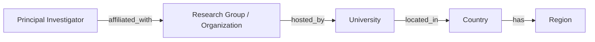

# Countries view

The countries view makes geography queryable without making country folders the canonical home of all research knowledge. It answers "which graph entities have a documented connection to this country or region?" rather than "which country is better?"

## Relationship resolution

The view uses a direct `country_id` where the entity owns a documented location and otherwise derives a person's or group's geographic facet through these documented relationships. A record may have more than one valid affiliation over time; the view must preserve dates and uncertainty instead of selecting a country by assumption.

## Supported facets

| Facet | Canonical source | Guardrail |
| --- | --- | --- |
| Country | Country ID reached through a documented relationship | Do not infer from name, nationality, or a conference location. |
| Region | The Country entity's controlled `region` value | Europe and Asia are filters, not quality categories. |
| City | A documented organization or university location | City is not a proxy for a lab's culture or eligibility. |
| Degree availability | Current program or PI/group evidence | MSc and PhD availability must be dated and can be unknown. |
| Instruction or working language | Current, explicit public evidence | Never infer an English-speaking environment from country alone. |

Examples of valid future selectors are `region = Europe`, `region = Asia`, `country = China`, and `country = Sweden`. They resolve through Country metadata and relationships; they never duplicate the country narrative into every result.

## What this view does not do

It does not rank countries, infer visa outcomes, treat a national label as a research-quality signal, or make a claim about language barriers, cost, funding, or mentoring. Those may be evidence-backed, applicant-specific inputs to a personal accessibility view only. The existing Turkey material remains where it is during this architecture phase and can later be linked from a country facet.

## Reference compatibility

The [AiiDA reference implementation](../../docs/reference-implementation.md)
validates the country traversal through [Paul Scherrer Institute](../../entities/organizations/paul-scherrer-institute.md) → [Switzerland](../../entities/countries/switzerland.md). These links document a canonical path, not a manually maintained country-view result.
