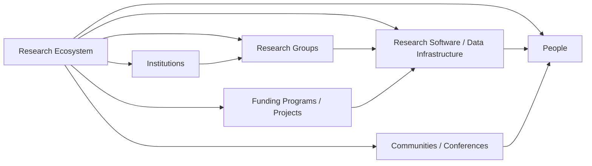

# Ecosystems view

The ecosystems view treats a research ecosystem as a connected, evidence-backed network rather than a country proxy or a brand label. Its canonical record connects people, research groups, software, institutions, funding, communities, conferences, projects, and research areas.

## Intended traversal

The reviewed [AiiDA Ecosystem](../../entities/ecosystems/aiida.md), [ASE Ecosystem](../../entities/ecosystems/ase.md), [Materials Project](../../entities/ecosystems/materials-project.md), [OQMD](../../entities/ecosystems/oqmd.md), [AFLOW](../../entities/ecosystems/aflow.md), [CP2K Ecosystem](../../entities/ecosystems/cp2k.md), [Materials Cloud](../../entities/ecosystems/materials-cloud.md), [FAIRmat](../../entities/ecosystems/fairmat.md), [FAIR Chemistry](../../entities/ecosystems/fair-chem.md), [LAMMPS Ecosystem](../../entities/ecosystems/lammps.md), [MatML](../../entities/ecosystems/matml.md), [Open Catalyst Project](../../entities/ecosystems/open-catalyst-project.md), [OpenKIM Ecosystem](../../entities/ecosystems/openkim.md), and [Quantum ESPRESSO Ecosystem](../../entities/ecosystems/quantum-espresso.md) are reviewed canonical ecosystem nodes. Their included software remains distinct—for example [ASE](../../entities/research-software/ase.md), [CP2K](../../entities/research-software/cp2k.md), [pymatgen](../../entities/research-software/pymatgen.md), [the AFLOW framework](../../entities/research-software/aflow.md), [NOMAD](../../entities/research-software/nomad.md), [KIM API](../../entities/research-software/kim-api.md), [LAMMPS](../../entities/research-software/lammps.md), and [Quantum ESPRESSO](../../entities/research-software/quantum-espresso.md). The Materialyze.AI slice adds a current, sourced [`pymatgen` lead-developer](../../entities/principal-investigators/shyue-ping-ong.md) and Materials Project contributor connection without assigning ecosystem ownership to NUS. Open Catalyst Project's documented code migration makes FAIRChem a time-bounded successor route; it is not a claim of common ownership or a complete OCP/FAIRChem graph. Existing comparison and source-register material retains its separate, report-scoped evidence role.

## View rules

- Ecosystem membership must state the relationship: maintainer, contributor, user, host, funder, partner, event participant, or another sourced predicate.
- The view may show the network topology and canonical links; it cannot copy its connected entities' bodies into a narrative ecosystem profile.
- An ecosystem's visible software or funding does not establish a current student opening, a mentorship style, immigration outcome, or a language environment.
- Country is a filter on connected institutions and people, not a replacement for the ecosystem model.

This view supports queries such as "Python-oriented materials data infrastructure connected to Europe" while preserving the difference between global evidence and an applicant's personal accessibility constraints.
