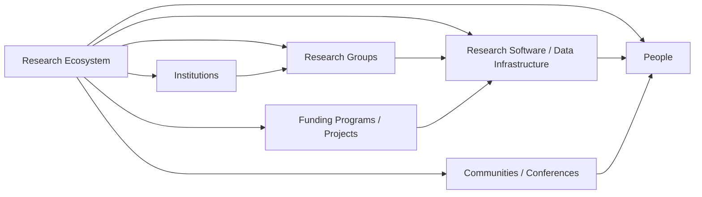

# Ecosystems view

The ecosystems view treats a research ecosystem as a connected, evidence-backed network rather than a country proxy or a brand label. Its canonical record connects people, research groups, software, institutions, funding, communities, conferences, projects, and research areas.

## Intended traversal

Materials Project, AiiDA, Materials Cloud, NOMAD, AFLOW, Open Catalyst Project, ASE, pymatgen, Quantum ESPRESSO, and LAMMPS are examples of names that can become ecosystem or software nodes when their connection type is documented. The existing [global ecosystem comparison](../../reports/global-ecosystems.md) and [source register](../../reports/global-sources.md) remain the current evidence trail.

## View rules

- Ecosystem membership must state the relationship: maintainer, contributor, user, host, funder, partner, event participant, or another sourced predicate.
- The view may show the network topology and canonical links; it cannot copy its connected entities' bodies into a narrative ecosystem profile.
- An ecosystem's visible software or funding does not establish a current student opening, a mentorship style, immigration outcome, or a language environment.
- Country is a filter on connected institutions and people, not a replacement for the ecosystem model.

This view supports queries such as "Python-oriented materials data infrastructure connected to Europe" while preserving the difference between global evidence and an applicant's personal accessibility constraints.
