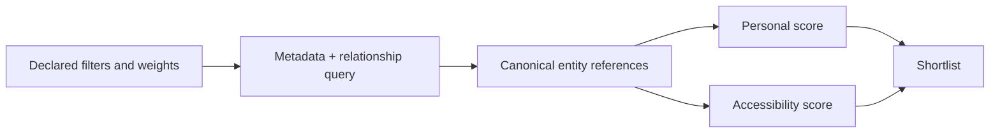

# My shortlist view

`my-shortlist` is a personal overlay over canonical entities. It answers "which records should this declared applicant investigate next?" It does not create a second profile for a PI, group, university, or software project.

## Allowed content

A future shortlist entry may contain:

- a canonical entity ID and link;
- the versioned personal profile or query that selected it;
- a private or explicitly shareable rationale tied to documented evidence;
- a personal score and accessibility score with coverage, confidence, and review date;
- a next research action, such as "read a paper" or "verify current degree eligibility."

It must not copy entity facts, rewrite source lists, claim an opening without a dated source, or convert a subjective preference into a global score. Personal preferences, finances, health, immigration status, private correspondence, and contact logs do not belong in canonical public entity records.

## Expected selection flow

The output should show personal and accessibility results separately by default. A user may make a private, documented decision ordering, but that ordering must never alter a global or public view. See [personalization](../../docs/personalization.md) and [scoring](../../docs/scoring.md).
