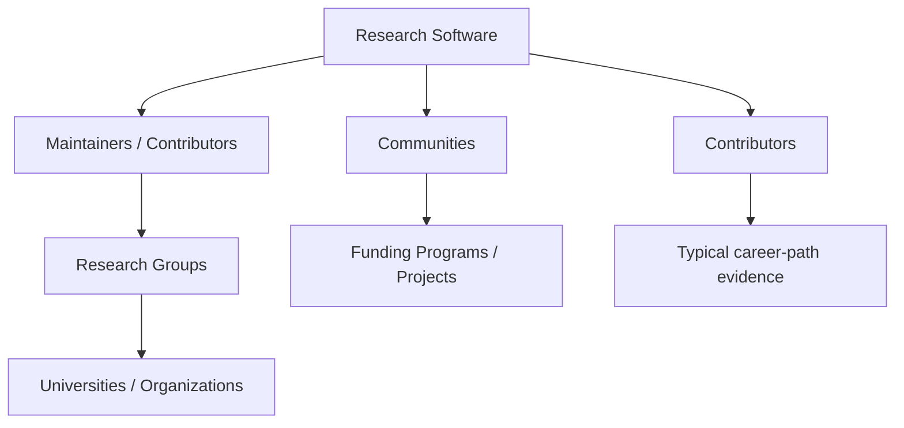

# Research software view

The research-software view makes software a first-class navigation mechanism. It begins with a canonical software record and follows documented stewardship, use, and community relationships outward. It does not duplicate a maintainer's profile or a lab's dossier in a software directory.

## Software-centered graph

The final node represents an evidence-backed navigation aid, not an assertion that a contributor will obtain a particular role. Career-path material must cite public project, employment, training, or alumni evidence and clearly mark unknowns.

## Relationship meanings

| Relationship | Meaning | Required caution |
| --- | --- | --- |
| `develops` / `maintains` | A documented technical stewardship role | A GitHub account or a one-off commit alone does not establish ownership. |
| `uses` | Documented use in research, teaching, or infrastructure | Avoid claiming proficiency from a citation alone. |
| `programming_language_ids` | Software-to-programming-language relationship | Use a controlled language ID, such as Python, not a prose guess. The v1 compatibility field is `language_ids`. |
| `funded_by` / `participates_in` | Public project or funding connection | Preserve dates and scope; funding can expire. |
| `participates_in` | Community, event, or contributor connection | Do not turn participation into endorsement or mentorship evidence. |

## Examples and facets

Useful software facets are license, language, repository URL, release activity, documentation, governance, research area, ecosystem, maintainer group, and host institution. The existing repository provides evidence trails for AiiDA, Materials Project, Materials Cloud, NOMAD, AFLOW, ASE, pymatgen, Quantum ESPRESSO, and LAMMPS; no new software records are created by this view architecture.

An "Open Source" filter requires evidence of a public license and relevant project practice, not simply a public repository. A "GitHub Active" filter must have a dated activity definition and never be used as a proxy for research quality or a person's availability.
