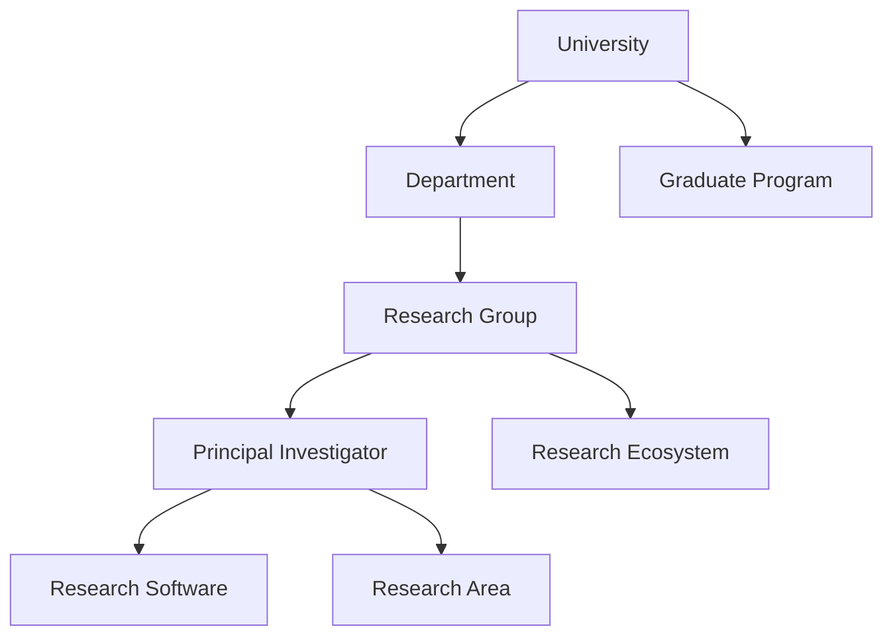

# Universities view

The universities view is an institutional traversal over canonical University records and their documented relationships. It lets a reader find the groups, people, departments, programs, software, projects, and ecosystems connected to an institution without reproducing any of their dossiers.

## Intended traversal

Each edge must be a typed, sourced relationship. A university view may display the canonical links and selected metadata for connected entities, but it must not copy their research statements, publication lists, or scores.

## Filters and evidence

Useful filters include Country/region, department, research area, program degree level, software connection, ecosystem, and record status. MSc/PhD eligibility must come from a current program or supervision source, not from the mere existence of a university record. A view can also expose evidence freshness so a reader can distinguish a current program page from an older research profile.

No university-level aggregate should be treated as a prestige ranking. A personal score may compare an applicant's stated needs with documented programs and groups, while accessibility remains separate and never changes a public university result.

## Reference compatibility

The reviewed [Northwestern University](../../entities/universities/northwestern-university.md), [Duke University](../../entities/universities/duke-university.md), and [National University of Singapore](../../entities/universities/national-university-of-singapore.md) paths demonstrate a Research Group resolving directly to a University and then to a Country record. They are canonical-link examples, not manually maintained university-view results.
